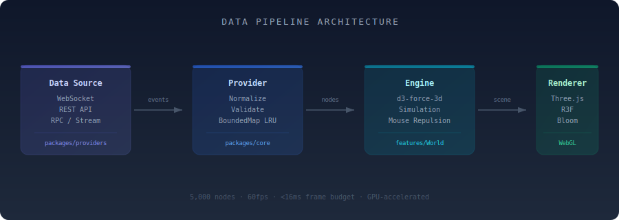

<p align="center">
  
</p>

<p align="center">
  
  
  
  
</p>

<h1 align="center">swarming</h1>

<p align="center">
  <strong>GPU-accelerated real-time 3D network visualization for any streaming data source.<br/>React + Three.js + D3-force. 5,000+ nodes at 60fps.</strong>
</p>

<p align="center">
  <a href="#quick-start">Quick Start</a> &bull;
  <a href="#features">Features</a> &bull;
  <a href="#architecture">Architecture</a> &bull;
  <a href="#packages">Packages</a> &bull;
  <a href="#pages--routes">Routes</a> &bull;
  <a href="#api-reference">API</a> &bull;
  <a href="#documentation">Docs</a>
</p>

---

## Table of Contents

- [Quick Start](#quick-start)
- [Features](#features)
- [Architecture](#architecture)
- [Project Structure](#project-structure)
- [Packages](#packages)
- [Pages & Routes](#pages--routes)
- [Data Providers](#data-providers)
- [Build Your Own Provider](#build-your-own-provider)
- [AI Integration](#ai-integration)
- [ZK Proof Verification](#zk-proof-verification)
- [Demo Scenarios](#demo-scenarios)
- [Desktop Shell UI](#desktop-shell-ui)
- [Visual Graph Editor](#visual-graph-editor)
- [WASM Physics Engine](#wasm-physics-engine)
- [Multi-Framework Support](#multi-framework-support)
- [Performance](#performance)
- [API Reference](#api-reference)
- [Tech Stack](#tech-stack)
- [Build & Development](#build--development)
- [Testing](#testing)
- [Documentation](#documentation)
- [Contributing](#contributing)
- [License](#license)

---

## Quick Start

### Use as a library

```bash
npm install @web3viz/core @web3viz/react-graph
```

```tsx
import { ForceGraph } from '@web3viz/react-graph'

function App() {
  return <ForceGraph topTokens={hubs} traderEdges={edges} />
}
```

GPU-accelerated force-directed graph with instanced rendering, mouse repulsion, proximity webs, and spring physics — out of the box.

### Run the full application

```bash
git clone https://github.com/nirholas/visualize-web3-realtime.git
cd visualize-web3-realtime
npm install
npm run dev
```

Open **http://localhost:3100** — a live 3D visualization starts immediately. No API keys needed for the default providers.

---

## Features

### 3D Visualization Engine
- **InstancedMesh rendering** — single draw call per node type for GPU efficiency
- **Spatial hashing** — O(1) neighbor lookups for interaction and physics
- **d3-force-3d physics** — framerate-independent damping, configurable springs, charge forces
- **Post-processing** — SMAA anti-aliasing, N8AO ambient occlusion, selective bloom
- **Camera system** — orbit controls, fly-to animations, auto-rotate, focus-on-node

### Real-time Streaming
- **Provider system** — plug in any data source (WebSocket, REST, custom)
- **Built-in providers** — Solana PumpFun, Ethereum/Base DEX, CEX volume, mock data
- **BoundedMap/BoundedSet** — LRU-evicting collections prevent unbounded memory growth
- **WebSocketManager** — automatic reconnection with exponential backoff

### Rich Interaction
- Hover, click, drag, orbit, zoom
- Mouse-repulsion physics
- Node labels with protocol icons
- Live trade feed with animated cards
- Timeline scrubber and stats bar

### AI-Powered
- **World Chat** — Claude Sonnet with tool-use for natural language graph control
- **Agent monitoring** — 3D visualization of AI agent orchestration at `/agents`
- **MCP Server** — Model Context Protocol server exposing live data to AI agents

### Desktop Shell UI
- Windows-style windowed interface with draggable, resizable panels
- Taskbar, start menu, system tray
- Connection status toasts and keyboard shortcuts
- Onboarding coach marks for first-time users

### More
- **ZK proof verification** — Giza LuminAIR STARK proof verification in the UI
- **Visual graph editor** — create/edit nodes and edges, undo/redo, import/export
- **WASM physics** — Rust Barnes-Hut simulation compiled to WebAssembly (3-5x faster than JS)
- **Multi-framework** — React, Vue, Svelte, React Native, vanilla JS wrappers
- **Multiplayer** — room-based collaboration server with cursors and presenter mode

---

## Architecture

```
                    ┌─────────────────────────────────────┐
                    │          Next.js App Router          │
                    │  (pages, API routes, middleware)     │
                    └──────────────┬──────────────────────┘
                                   │
               ┌───────────────────┼───────────────────┐
               │                   │                   │
        ┌──────▼──────┐    ┌──────▼──────┐    ┌──────▼──────┐
        │   /world    │    │   /agents   │    │   /demos    │
        │  ForceGraph │    │ AgentForce  │    │  6 scenarios│
        │  3D scene   │    │   Graph     │    │  mock data  │
        └──────┬──────┘    └──────┬──────┘    └─────────────┘
               │                  │
        ┌──────▼──────────────────▼──────┐
        │     @web3viz/react-graph       │
        │  React Three Fiber + d3-force  │
        └──────────────┬─────────────────┘
                       │
        ┌──────────────▼─────────────────┐
        │         @web3viz/core          │
        │  Types, physics, categories,   │
        │  provider interface, themes    │
        └──────────────┬─────────────────┘
                       │
        ┌──────────────▼─────────────────┐
        │       @web3viz/providers       │
        │  PumpFun, Ethereum, Base,      │
        │  CEX, ERC-8004, Mock           │
        └────────────────────────────────┘
```

The system uses a **provider → core → renderer** pipeline. Data providers emit standardized events, the core engine manages physics simulation and graph state, and the React Three Fiber renderer handles GPU-accelerated 3D output.

See [docs/ARCHITECTURE.md](docs/ARCHITECTURE.md) for the full system design and data flow.

---

## Project Structure

```
app/                    # Next.js App Router (pages, API routes)
  api/executor/         # Proxy to executor backend
  api/world-chat/       # Claude Sonnet chat endpoint
  api/.well-known/      # x402 protocol manifest
features/
  World/                # 3D visualization — ForceGraph, StatsBar, Timeline
    desktop/            # Desktop shell UI (taskbar, windows, start menu)
    utils/              # shared.ts (hex, formatting), accessibility.ts
    verification/       # Giza LuminAIR ZK verification components
    onboarding/         # Coach marks and onboarding prompts
    components/         # Reusable UI (sidebar, protocol filters)
  Agents/               # Agent visualization — AgentForceGraph, sidebar, feed
  Landing/              # Landing page with custom 3D scenes and shaders
  Demos/                # 6 demo scenarios with mock data generators
  Tools/                # Third-party tool integration pages
  Scrollytelling/       # Scroll-driven narrative landing page
packages/
  core/                 # Core types, physics, provider interface (zero React deps)
  providers/            # Data provider implementations
  react-graph/          # React Three Fiber <ForceGraph /> component
  ui/                   # Design system — buttons, panels, feeds, theming
  utils/                # Screenshots, share URLs, formatting helpers
  mcp/                  # MCP server (DeFi Llama, cookie.fun, proof registry)
  agent-bridge/         # AI agent connection layer (Claude Code, stdin adapter)
  swarming-physics/     # Rust → WASM Barnes-Hut force simulation
  swarming-collab-server/ # WebSocket relay for multiplayer collaboration
  engine/               # Framework-agnostic engine with vanilla JS API
  vue/                  # Vue 3 wrapper
  svelte/               # Svelte wrapper
  react-native/         # React Native + Expo wrapper
  create-swarming-app/  # CLI scaffolder (npx create-swarming-app)
  create-swarming-plugin/ # Plugin scaffolder
  tsconfig/             # Shared TypeScript configs
  tailwind-config/      # Shared Tailwind config
  executor/             # ⚠️ BROKEN — missing ws dep
apps/
  playground/           # Standalone Next.js playground (port 3200)
  mobile-demo/          # Expo React Native demo app
```

---

## Packages

### Core

| Package | Description |
|---|---|
| [`@web3viz/core`](packages/core/) | Types, physics engine, provider interface, category system. Zero React deps. |
| [`@swarming/engine`](packages/engine/) | Framework-agnostic engine — vanilla JS API with `createSwarming()` |
| [`swarming-physics`](packages/swarming-physics/) | Rust Barnes-Hut simulation compiled to WASM — 3-5x faster than JS d3-force |
| [`@web3viz/providers`](packages/providers/) | Data providers (PumpFun, Ethereum, Base, CEX, Mock, + build your own) |
| [`@web3viz/ui`](packages/ui/) | Design system — buttons, panels, feeds, filters, theming with CSS custom properties |
| [`@web3viz/utils`](packages/utils/) | Screenshots, share URLs, formatting helpers |

### React & Framework Wrappers

| Package | Description |
|---|---|
| [`@web3viz/react-graph`](packages/react-graph/) | `<ForceGraph>` component (Three.js + React Three Fiber) |
| [`@swarming/react`](packages/react/) | Thin React wrapper around `@swarming/engine` |
| [`@swarming/vue`](packages/vue/) | Vue 3 wrapper |
| [`@swarming/svelte`](packages/svelte/) | Svelte wrapper |
| [`@swarming/react-native`](packages/react-native/) | React Native + Expo with GL renderer, haptics, gestures, battery awareness |

### Collaboration & Tooling

| Package | Description |
|---|---|
| [`swarming-collab-server`](packages/swarming-collab-server/) | WebSocket relay for multiplayer (rooms, cursors, presenter mode) |
| [`@web3viz/mcp`](packages/mcp/) | MCP server — DeFi Llama, cookie.fun, proof registry for AI agents |
| [`@web3viz/agent-bridge`](packages/agent-bridge/) | Agent connection layer for Claude Code, OpenClaw, Hermes, stdin adapter |
| [`create-swarming-app`](packages/create-swarming-app/) | CLI scaffolder — `npx create-swarming-app` (5 templates) |
| [`create-swarming-plugin`](packages/create-swarming-plugin/) | Plugin project scaffolder |

### Dependency Graph

```
@web3viz/core              ← zero dependencies, pure TypeScript
    ↑
@web3viz/providers         ← implements DataProvider interface
@web3viz/react-graph       ← React Three Fiber + d3-force-3d
@web3viz/ui                ← React + Tailwind + CSS custom properties
@web3viz/utils             ← tiny helpers
@swarming/engine           ← framework-agnostic rendering + physics
    ↑
@swarming/react            ← thin React wrapper
@swarming/vue              ← thin Vue wrapper
@swarming/svelte           ← thin Svelte wrapper
@swarming/react-native     ← Expo GL + gesture handler
```

---

## Pages & Routes

| Route | Description |
|---|---|
| `/` | Scrollytelling landing page with 3D scenes |
| `/world` | Main 3D visualization with live data providers |
| `/agents` | AI agent monitoring dashboard (force graph, sidebar, feed, timeline) |
| `/demos` | Demo hub |
| `/demos/ai-agents` | Multi-agent orchestration visualization |
| `/demos/api-traffic` | Service mesh and API call monitoring |
| `/demos/github` | Repository activity and contributor networks |
| `/demos/iot` | Sensor networks and device telemetry |
| `/demos/kubernetes` | Pod topology, traffic, and scaling events |
| `/demos/social` | Interaction graphs and content cascades |
| `/tools/*` | Tool comparison pages (Cosmograph, Graphistry, ReaGraph, and more) |
| `/showcase` | Community showcase gallery |
| `/plugins` | Plugin directory |
| `/benchmarks` | Interactive benchmark results viewer |
| `/blog` | Blog with markdown content |
| `/docs` | Documentation viewer |
| `/embed` | Embeddable widget with URL param customization |
| `/playground` | Interactive playground |

### API Routes

| Endpoint | Description |
|---|---|
| `/api/world-chat` | Claude Sonnet chat with tool-use for graph control |
| `/api/executor` | Proxy to agent executor backend |
| `/api/agents/cookie` | cookie.fun agent data |
| `/api/.well-known/x402-manifest` | x402 payment protocol manifest |

---

## Data Providers

| Provider | Chain / Source | Data |
|---|---|---|
| **Solana PumpFun** | Solana | Token launches, trades, and claims via `wss://pumpportal.fun/api/data` |
| **Ethereum** | Ethereum | Uniswap / DEX swaps and liquidity events |
| **Base** | Base | Real-time on-chain activity |
| **ERC-8004** | Multi-chain | ERC-8004 token events |
| **CEX Volume** | Binance | Liquidations and trade data |
| **Mock** | — | Synthetic events for development and testing |

All providers emit standardized events through the `DataProvider` interface. Data is validated with `packages/providers/src/shared/validate.ts` helpers. WebSocket connections are managed by `WebSocketManager` with automatic reconnection and exponential backoff.

---

## Build Your Own Provider

```typescript
import type { DataProvider } from '@web3viz/core'

class MyProvider implements DataProvider {
  readonly id = 'my-source'
  readonly name = 'My Data Source'
  readonly sourceConfig = { id: 'custom', label: 'Custom', color: '#6366f1', icon: '◉' }
  readonly categories = [
    { id: 'events', label: 'Events', icon: '⚡', color: '#6366f1', source: 'custom' },
  ]

  connect() {
    const ws = new WebSocket('wss://your-stream.com')
    ws.onmessage = (msg) => {
      const data = JSON.parse(msg.data)
      this.emit({
        id: data.id,
        providerId: this.id,
        category: 'events',
        timestamp: Date.now(),
        label: data.name,
        amount: data.value,
      })
    }
  }
}
```

See the full guide: [docs/PROVIDERS.md](docs/PROVIDERS.md)

---

## AI Integration

### World Chat

An AI assistant embedded in the `/world` visualization that controls the graph through natural language. Powered by **Claude Sonnet with tool-use** — ask it to focus on a node, filter categories, change colors, or explain what's happening in the network.

### Agent Monitoring

Full agent orchestration dashboard at `/agents`:

- **AgentForceGraph** — 3D force graph of agents, tasks, tool calls, and tokens
- **AgentSidebar** — agent configuration and status
- **AgentLiveFeed** — real-time event stream
- **AgentTimeline** — temporal event visualization
- **TaskInspector** — task analysis and debugging
- **AgentStatsBar** — aggregate metrics

### MCP Server

Model Context Protocol server (`@web3viz/mcp`) exposes live data to AI agents:

| Resource | Description |
|---|---|
| `protocol_stats` | DeFi Llama TVL and protocol metrics |
| `recent_trades` | Real-time trade feed |
| `agent_activity` | cookie.fun agent rankings |
| `proof_status` | LuminAIR STARK proof verification status |

### Agent Bridge

The `@web3viz/agent-bridge` package provides connection adapters for AI agents:
- **Claude Code** integration
- **stdin adapter** for CLI-based agents
- **OpenClaw** and **Hermes** agent protocols

---

## ZK Proof Verification

Built-in **Giza LuminAIR** integration for zero-knowledge proof verification. The `VerifyBadge` and `VerificationModal` components provide step-by-step STARK proof verification directly in the UI.

- Uses inline styles (no Tailwind dependency) for isolation
- Gracefully degrades to **demo mode** if `@gizatech/luminair-web` is not installed
- Located in `features/World/verification/`

---

## Demo Scenarios

6 pre-built demo scenarios with mock data generators at `/demos`:

| Demo | Description |
|---|---|
| **AI Agents** | Multi-agent orchestration — tasks, tool calls, token flows |
| **API Traffic** | Service mesh monitoring — request routing, latency, errors |
| **GitHub** | Repository activity — commits, PRs, contributor networks |
| **IoT** | Sensor networks — device telemetry, fleet tracking |
| **Kubernetes** | Pod topology — scaling events, traffic, resource usage |
| **Social Networks** | Interaction graphs — follow networks, content cascades |

Each demo uses `useDemoSimulation.ts` for shared simulation logic with configurable parameters.

---

## Desktop Shell UI

A windowed desktop-style interface located in `features/World/desktop/`:

- **DesktopShell** — full desktop environment container
- **Taskbar** — app icons, connection status, system tray
- **StartMenu** — navigation and settings
- **Window manager** — draggable, resizable panels with `useWindowManager` hook
- Keyboard shortcuts and connection status toasts
- Onboarding coach marks for first-time users

---

## Visual Graph Editor

Full-featured graph editing mode included in the `swarming` package:

- Create, delete, and drag nodes and edges
- Inline label editing and context menus
- Undo/redo with full history (`Ctrl+Z` / `Ctrl+Shift+Z`)
- Marquee selection and copy/paste
- Auto-layout algorithms
- Import/export: JSON, Mermaid, CSV, SVG

---

## WASM Physics Engine

The `swarming-physics` package provides a **Rust Barnes-Hut simulation** compiled to WebAssembly:

- **3-5x faster** than JavaScript d3-force-3d
- Off-thread computation via Web Workers
- Progressive fallback to JS if WASM is unavailable
- Barnes-Hut tree approximation for O(n log n) force calculations

---

## Multi-Framework Support

### React (primary)
```tsx
import { ForceGraph } from '@web3viz/react-graph'

<ForceGraph topTokens={hubs} traderEdges={edges} />
```

### Vue 3
```vue
<script setup>
import { SwarmingGraph } from '@swarming/vue'
</script>
<template>
  <SwarmingGraph :nodes="hubs" :edges="connections" />
</template>
```

### Svelte
```svelte
<script>
import { SwarmingGraph } from '@swarming/svelte'
</script>
<SwarmingGraph {nodes} {edges} />
```

### React Native (Expo)
```tsx
import { SwarmingView } from '@swarming/react-native'

export default () => <SwarmingView nodes={hubs} edges={connections} />
```

### Vanilla JS / CDN
```html
<script src="https://unpkg.com/swarming"></script>
<div id="viz"></div>
<script>
  Swarming.create('#viz', { source: 'wss://your-stream.com' })
</script>
```

---

## Performance

Uses **InstancedMesh** (single draw call per node type), **SpatialHash** grids for O(1) lookups, and framerate-independent physics.

| | swarming | d3-force (SVG) | sigma.js | cytoscape |
|---|---|---|---|---|
| **1,000 nodes** | 60 fps | 45 fps | 55 fps | 40 fps |
| **5,000 nodes** | 60 fps | 12 fps | 30 fps | 8 fps |
| **10,000 nodes** | 45 fps | 3 fps | 15 fps | crash |
| **Rendering** | WebGL 3D | SVG / Canvas | WebGL 2D | Canvas 2D |
| **Streaming data** | Built-in | DIY | DIY | DIY |
| **React Native** | Yes (R3F) | Wrapper | Wrapper | Wrapper |
| **WASM option** | Yes (Rust) | No | No | No |

---

## API Reference

### `<ForceGraph>` Props

| Prop | Type | Description |
|---|---|---|
| `nodes` | `HubNode[]` | Hub nodes |
| `edges` | `Edge[]` | Connections between nodes |
| `simulationConfig` | `SimulationConfig` | Physics parameters (charge, damping, springs) |
| `background` | `string` | Scene background color |
| `showLabels` | `boolean` | Toggle hub labels |
| `showGround` | `boolean` | Toggle ground plane |
| `fov` | `number` | Camera field of view |
| `cameraPosition` | `[x, y, z]` | Initial camera position |

### Imperative Handle

```tsx
const ref = useRef<GraphHandle>(null)

ref.current.focusHub(0)                            // Fly camera to hub
ref.current.animateCameraTo([10, 20, 30], origin)  // Custom fly-to
ref.current.setOrbitEnabled(true)                   // Toggle auto-rotate
```

Full API reference: [docs/COMPONENTS.md](docs/COMPONENTS.md)

---

## Tech Stack

| Layer | Technology |
|---|---|
| **Framework** | Next.js 14 (App Router) |
| **3D Engine** | Three.js + React Three Fiber + drei |
| **Physics** | d3-force-3d + WASM Barnes-Hut (Rust) |
| **Animation** | Framer Motion |
| **Post-processing** | SMAA, N8AO ambient occlusion, selective bloom |
| **Styling** | Tailwind CSS + CSS custom properties |
| **AI** | Claude Sonnet (tool-use), Model Context Protocol |
| **ZK Proofs** | Giza LuminAIR (STARK verification) |
| **Collaboration** | WebSocket relay with room-based sync |
| **Code Editor** | CodeMirror 6 |
| **Validation** | Zod |
| **Language** | TypeScript (strict mode) |
| **Monorepo** | npm workspaces + Turborepo |
| **Testing** | Vitest + Testing Library |

---

## Build & Development

```bash
npm run dev          # Dev server on port 3100
npm run build        # Build the Next.js app (must pass)
npm run typecheck    # TypeScript check (must pass)
npm run lint         # ESLint
npm test             # Run all tests (vitest)
npm test -- --run packages/core   # Tests for a specific package
```

> **Note:** Do NOT use `turbo run build` — `packages/executor` (missing `ws` dep) and `apps/playground` (broken import) will fail. Use `npm run build` which only builds the main Next.js app.

### Type-check a specific package

```bash
npx tsc --noEmit -p packages/providers/tsconfig.json
```

### Path Aliases

- `@/*` maps to the project root
- `@web3viz/<pkg>` maps to `packages/<pkg>/src`

### Key Conventions

- `BoundedMap`/`BoundedSet` for all caches (LRU-evicting, never unbounded)
- Verification components use inline styles (no Tailwind)
- All external data validated with `packages/providers/src/shared/validate.ts`
- No default exports for non-page components

---

## Testing

Tests use **Vitest** with **jsdom**. Config in `vitest.config.ts`. Tests live in `__tests__/` directories adjacent to source.

```bash
npm test                        # Run all tests
npm test -- --watch             # Watch mode
npm test -- --coverage          # With coverage
npm test -- --run packages/core # Specific package
```

Coverage targets: `packages/core/src`, `packages/providers/src`, `packages/utils/src`, `features/World/utils`

---

## Documentation

| Doc | Description |
|---|---|
| [Architecture](docs/ARCHITECTURE.md) | System design, data flow, performance internals |
| [Providers](docs/PROVIDERS.md) | Build custom data providers |
| [Components](docs/COMPONENTS.md) | ForceGraph + UI component API reference |
| [Deployment](docs/DEPLOYMENT.md) | Vercel, Docker, self-hosted |
| [SDK](SDK.md) | Package descriptions and usage guide |
| [Contributing](CONTRIBUTING.md) | Dev setup, code style, PR guidelines |
| [Changelog](CHANGELOG.md) | Notable changes |

### Diagrams

SVG architecture and component diagrams are available in [`public/diagrams/`](public/diagrams/):

`architecture` · `data-flow` · `dependency-graph` · `world-page-layout` · `agent-page-layout` · `agent-sidebar` · `agent-timeline` · `agent-live-feed` · `agent-stats-bar` · `agent-label` · `task-inspector` · `executor-architecture` · `executor-status` · `provider-architecture` · `provider-config-panel`

---

## Contributing

Contributions are welcome. See [CONTRIBUTING.md](CONTRIBUTING.md) for dev setup, code style, and PR guidelines.

**High-impact areas:**
- New data providers (network traffic, IoT, social, blockchain)
- Performance (WebGPU, compute shaders)
- Framework wrappers (Vue, Svelte improvements)
- Collaboration features and multiplayer UX
- Mobile/touch interaction
- Accessibility
- Documentation and examples

---

## License

All Rights Reserved. Copyright (c) 2026.

---

<p align="center">
  Built by <a href="https://github.com/nirholas">@nirholas</a>
</p>

<p align="center">
  <sub>See your data swarm.</sub>
</p>
