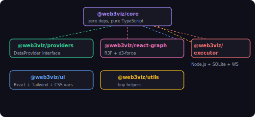
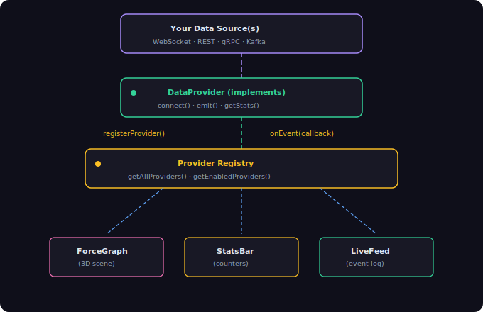

<p align="center">
  
  
  
  
</p>

# swarming.world

> **Live:** [swarming.world](https://swarming.world/world) · [visualizing.vercel.app](https://visualizing.vercel.app/world)

**Real-time 3D force-graph visualization toolkit for streaming data.**

Plug in any data source — blockchain transactions, AI agent activity, network traffic, social graphs, IoT telemetry — and get a beautiful, interactive, 60fps particle network out of the box.

```bash
npm install @web3viz/core @web3viz/react-graph @web3viz/ui
```

```tsx
import { ForceGraph } from '@web3viz/react-graph';

<ForceGraph topTokens={hubs} traderEdges={edges} />
```

That's it. You have a GPU-accelerated force-directed graph with instanced rendering, mouse repulsion, proximity webs, camera orbits, and spring physics.

---

## Why web3viz?

Most real-time visualization tools make you choose: **pretty or performant, simple API or flexible architecture, one data source or build everything yourself.**

web3viz gives you all of it:

| | web3viz | D3.js | Sigma.js | Cytoscape |
|---|---|---|---|---|
| 3D rendering | Yes (Three.js) | SVG/Canvas only | WebGL 2D | Canvas 2D |
| Nodes at 60fps | 5,000+ | ~500 | ~10,000 (2D) | ~1,000 |
| Streaming data | Built-in provider system | DIY | DIY | DIY |
| React integration | Native (R3F) | Wrapper needed | Wrapper needed | Wrapper needed |
| Camera system | Orbit, focus, tour | N/A | Basic pan/zoom | Pan/zoom |
| Design system included | Yes | No | No | No |
| TypeScript | Strict mode | Partial | Yes | Yes |

---

## Quick Start

### See it live in 30 seconds

```bash
git clone https://github.com/nirholas/swarming.world.git
cd swarming.world
npm install
npm run dev
```

Open **http://localhost:3100** — a live visualization of Solana PumpFun activity starts immediately. No API keys needed.

### Use the mock provider for development

```bash
npm run dev:playground
```

Opens a standalone demo with synthetic data — no blockchain connection required.

---

## Packages

web3viz is a modular monorepo. Use the pieces you need:

| Package | Description | Size |
|---|---|---|
| [`@web3viz/core`](packages/core/) | Types, physics engine, provider interface, category system. Zero React deps. | ~15KB |
| [`@web3viz/react-graph`](packages/react-graph/) | React Three Fiber `<ForceGraph />` component | ~25KB |
| [`@web3viz/providers`](packages/providers/) | Data provider implementations (PumpFun, Mock, + your own) | ~20KB |
| [`@web3viz/ui`](packages/ui/) | Design system — buttons, panels, feeds, filters, theming | ~30KB |
| [`@web3viz/utils`](packages/utils/) | Screenshots, share URLs, formatting helpers | ~8KB |
| [`@web3viz/executor`](packages/executor/) | Standalone agent executor server (WebSocket broadcast) | ~15KB |

### Dependency graph



---

## Build Your Own Provider

The provider system is the core abstraction. Any streaming data source becomes a visualization by implementing one interface:

```typescript
import type { DataProvider } from '@web3viz/core';

class EthereumSwapProvider implements DataProvider {
  readonly id = 'uniswap';
  readonly name = 'Uniswap V3';
  readonly sourceConfig = {
    id: 'ethereum',
    label: 'Ethereum',
    color: '#627EEA',
    icon: '⬡',
  };
  readonly categories = [
    { id: 'swaps', label: 'Swaps', icon: '⇄', color: '#627EEA', source: 'ethereum' },
    { id: 'liquidity', label: 'LP Events', icon: '◈', color: '#8799EE', source: 'ethereum' },
  ];

  connect() {
    const ws = new WebSocket('wss://your-indexer.com/stream');
    ws.onmessage = (msg) => {
      const swap = JSON.parse(msg.data);
      this.emit({
        id: swap.txHash,
        providerId: this.id,
        category: 'swaps',
        timestamp: Date.now(),
        label: `${swap.tokenIn} → ${swap.tokenOut}`,
        amount: swap.amountUSD,
        address: swap.sender,
        tokenAddress: swap.pool,
      });
    };
  }

  // ... implement remaining interface methods
}
```

Register it and the entire UI lights up:

```typescript
import { registerProvider } from '@web3viz/core';

registerProvider(new EthereumSwapProvider());
```

The `<ForceGraph>`, `<StatsBar>`, `<LiveFeed>`, and `<FilterSidebar>` all react automatically.

---

## Use Cases

### Blockchain & DeFi
- **DEX activity** — Uniswap, Jupiter, Raydium swaps in real-time
- **Token launches** — PumpFun, pump.fun clones, fair launch platforms
- **MEV visualization** — Searcher bundles, sandwich attacks, arbitrage paths
- **Cross-chain bridges** — Wormhole, LayerZero message flows
- **NFT minting** — Collection mints as particle clusters
- **Validator networks** — Stake delegation flows, attestation patterns

### AI & Agents
- **Agent orchestration** — Visualize multi-agent task execution (built-in executor)
- **LLM tool calls** — Watch agents invoke tools, spawn sub-agents, reason
- **Swarm behavior** — Multi-agent coordination patterns

### Infrastructure & DevOps
- **API traffic** — Request flows across microservices
- **Log streams** — Error clustering, anomaly detection
- **Kubernetes** — Pod scheduling, service mesh traffic
- **CI/CD pipelines** — Build/deploy event streams

### Social & Communication
- **Chat networks** — Message flows in Discord, Slack, Telegram
- **Social graphs** — Follow/interaction networks
- **Content virality** — Repost/share cascades

### IoT & Sensor Data
- **Device telemetry** — Temperature, pressure, vibration clusters
- **Fleet tracking** — Vehicle/drone position streams
- **Smart grid** — Energy production/consumption flows

---

## The `<ForceGraph>` Component

The visualization engine at the heart of web3viz:

```tsx
import { ForceGraph, type GraphHandle } from '@web3viz/react-graph';

const graphRef = useRef<GraphHandle>(null);

<ForceGraph
  ref={graphRef}
  topTokens={hubs}           // Hub nodes (up to 8)
  traderEdges={edges}        // Participant → hub connections (up to 5,000)
  simulationConfig={{
    hubChargeStrength: -200,
    agentChargeStrength: -8,
    centerStrength: 0.03,
    hubLinkDistance: 25,
    damping: 0.92,
  }}
  background="#0a0a0f"
  showLabels
  showGround={false}
  fov={50}
  cameraPosition={[0, 15, 45]}
/>
```

### Imperative API

```typescript
graphRef.current.focusHub(0);                          // Fly camera to hub
graphRef.current.animateCameraTo([10, 20, 30], origin); // Custom animation
graphRef.current.setOrbitEnabled(true);                 // Auto-rotate
graphRef.current.getHubCount();                         // Number of hubs
```

### Performance

| Metric | Value |
|---|---|
| Max nodes at 60fps | 5,000+ |
| Rendering | InstancedMesh (single draw call per node type) |
| Spatial queries | SpatialHash grid — O(1) neighbor lookups |
| Physics | Framerate-independent damping (`damping^(dt*60)`) |
| Lines | Up to 800 proximity + 320 tether lines |
| Blending | Additive (luminous glow effect) |

---

## UI Components

The design system works standalone or with the graph:

```tsx
import { ThemeProvider, StatsBar, LiveFeed, FilterSidebar } from '@web3viz/ui';

<ThemeProvider theme="dark">
  <StatsBar stats={stats} />
  <LiveFeed events={recentEvents} />
  <FilterSidebar categories={categories} onToggle={handleToggle} />
</ThemeProvider>
```

**Included components:** Button, Pill, Badge, Input, Dialog, Panel, ColorControl, StatsBar, LiveFeed, FilterSidebar, SharePanel, InfoPopover, JourneyOverlay.

**Theming:** CSS custom properties with light/dark presets. Fully customizable via design tokens.

---

## Guided Tours

Built-in camera tour system for onboarding users:

```typescript
import { useJourney } from '@web3viz/ui';

const { start, skip, currentStep } = useJourney({
  steps: [
    { label: 'Welcome', camera: [0, 30, 60], duration: 3000 },
    { label: 'Most Active', focusHub: 0, duration: 4000 },
    { label: 'Explore', freeOrbit: true },
  ],
});
```

---

## Architecture



### Monorepo Structure

```
web3viz/
├── packages/
│   ├── core/              # Types, engine, provider interface (0 deps)
│   ├── react-graph/       # <ForceGraph> component (Three.js + d3-force)
│   ├── providers/         # PumpFun, Mock, and provider hooks
│   ├── ui/                # Design system (tokens, theme, components)
│   ├── utils/             # Screenshots, sharing, formatting
│   └── executor/          # Standalone agent executor (Node.js)
├── apps/
│   └── playground/        # Demo app with mock data
├── app/                   # Reference app: live PumpFun visualizer
│   ├── world/             # Blockchain visualization route
│   ├── agents/            # AI agent monitoring route
│   └── embed/             # Embeddable widget
└── features/              # Feature modules for the reference app
```

---

## Landing Page

The landing page uses the **Pretext Editorial Engine** (`@chenglou/pretext`) to flow responsive editorial text around a live 3D force graph.

- **Giza Scene** — 8 protocol nodes (Morpho, Aave, Compound, Moonwell, Euler, Fluid, Uniswap, Lido) with 120 orbiting agent particles each
- **Custom GLSL shaders** — Simplex 3D noise for organic sphere surfaces, orbital agent motion, protocol-to-protocol connection trails
- **Editorial overlay** — Text reflows every frame around the 3D graph projection using Pretext's cursor-based line layout and DOM pooling
- **Orb physics** — Velocity integration, wall bouncing, and inter-orb repulsion for animated background elements

Routes: `/` and `/landing` both serve the landing engine.

---

## Reference App: PumpFun Visualizer

The included reference app connects to live Solana data:

- **2 concurrent WebSocket streams** — PumpPortal (trades) + Solana RPC (claims)
- **6 event categories** — Launches, Agent Launches, Trades, Wallet/GitHub/First Claims
- **AI agent detection** — Regex heuristic on token names
- **Address search** — Find any wallet in the network, camera flies to it
- **Share/export** — Screenshot with metadata overlay, social sharing
- **Guided tour** — 7-step narrated camera walkthrough

### Desktop OS Shell

The world view is wrapped in a full desktop metaphor:

- **Taskbar** — Fixed bottom bar with pinned app icons, system tray, and live clock
- **Start Menu** — Launch panel with app grid (Sources, Stats, Chat, Timeline, etc.)
- **Floating windows** — Draggable, minimizable, closable panels with glassmorphism styling
- **Window manager** — Z-index stacking, focus tracking, state persisted to localStorage

**Keyboard shortcuts:**

| Key | Action |
|---|---|
| `?` | Toggle help overlay |
| `Space` | Play / Pause |
| `Escape` | Close menu / overlay |
| `1`–`6` | Toggle windows (Filters, Live Feed, Stats, AI Chat, Share, Data Sources) |

### Onboarding

A 7-step guided walkthrough for first-time visitors:

1. **Welcome** — Introduction to the 3D blockchain visualization
2. **Start Menu** — Launch tools from the W3 button
3. **Data Sources** — Enable providers (PumpFun, Ethereum) to stream live data
4. **Graph Controls** — Drag to rotate, scroll to zoom, hover hubs for categories
5. **Taskbar & Windows** — Drag, minimize, close floating windows
6. **Search** — Find wallets via the Stats window; camera flies to the address
7. **Finish** — Ready to explore

Completion state is persisted to localStorage. The initial prompt appears non-intrusively above the taskbar after 1.5s for new visitors only.

### AI Chat

An integrated chat panel powered by Claude with tool calling:

| Tool | Description |
|---|---|
| `sceneColorUpdate` | Change background, protocol nodes, and user node colors; adjust bloom |
| `cameraFocus` | Fly camera to a hub index or custom `[x, y, z]` position |
| `dataFilter` | Filter by protocol, volume threshold, or time range |
| `agentSummary` | Display a metrics summary card with labeled values |
| `tradeVisualization` | Highlight specific trades with custom color and duration |

The chat receives live context (event count, volume, connections, hub count) so the AI can reason about the current state of the visualization.

### ZK Verification

STARK proof verification via **Giza LuminAIR** with a 5-step pipeline:

1. Protocol Setup
2. Commit Preprocessed Trace
3. Commit Main Trace
4. Commit Interaction Trace
5. Verify with STWO

Runs in-browser via WASM. Degrades gracefully to demo mode if `@gizatech/luminair-web` is not installed.

### Agents Dashboard

The `/agents` route provides real-time AI agent monitoring:

- **Agent lifecycle tracking** — Spawn, execute, complete, fail states
- **Task inspector** — Execution details, tool calls, sub-agent trees
- **Timeline scrubber** — Scrub through historical task execution
- **Agent force graph** — Visualize agent coordination as a network
- **SperaxOS integration** — Live WebSocket stream from agent backend (with mock mode for development)

### Tools Hub

The `/tools` route hosts 7 standalone visualization experiments:

| Tool | Description |
|---|---|
| Cosmograph | GPU-accelerated WebGL graph (Apache Arrow + DuckDB) |
| Reagraph | React WebGL network graph (Three.js + D3) |
| Graphistry | GPU-powered visual graph intelligence platform |
| Blockchain Visualizer | P2P network simulation with data packets |
| AI Office | Procedural 3D world of autonomous AI agents (math-only, no assets) |
| Creative Coding | WebGL shader playground (Cables.gl / Nodes.io inspired) |
| NVEIL | Volumetric 3D data rendering and spatial dashboards |

### Routes

| Route | Description |
|---|---|
| `/` | Landing page (Pretext Editorial Engine + Giza 3D scene) |
| `/landing` | Landing page (alternate route) |
| `/world` | Live PumpFun visualization |
| `/world?address=<addr>` | Auto-search for a Solana address |
| `/agents` | AI agent monitoring dashboard |
| `/tools` | Tools hub with 7 standalone demos |
| `/tools/[tool-name]` | Individual tool demo |
| `/embed` | Embeddable widget |

### API Routes

| Endpoint | Method | Description |
|---|---|---|
| `/api/world-chat` | POST | Claude agent endpoint — accepts messages + live context, returns text + tool actions |
| `/api/executor` | GET/POST | Proxy to agent executor backend (status, task creation) |

---

## Configuration

### Physics

All simulation parameters are configurable:

| Parameter | Default | Description |
|---|---|---|
| `hubChargeStrength` | `-200` | Hub-to-hub repulsion |
| `agentChargeStrength` | `-8` | Node-to-node repulsion |
| `centerStrength` | `0.03` | Pull toward origin |
| `hubLinkDistance` | `25` | Spring rest length (hubs) |
| `agentLinkDistance` | `5-8` | Spring rest length (nodes) |
| `damping` | `0.92` | Velocity decay per frame |
| `alphaDecay` | `0.01` | Simulation cooling rate |

### Rendering

| Parameter | Default | Description |
|---|---|---|
| Hub count | `8` | Max hub nodes |
| Max particles | `5,000` | Instanced mesh capacity |
| Proximity lines | `800` | Max inter-node lines |
| Tether lines/hub | `40` | Lines connecting nodes to hubs |
| Camera orbit | `0.06 rad/s` | Auto-rotation speed |
| Repulsion radius | `6` | Mouse cursor push radius |

---

## Environment Variables

Copy `.env.example` to `.env.local` and configure:

| Variable | Required | Description |
|---|---|---|
| `NEXT_PUBLIC_SOLANA_WS_URL` | Yes | Solana WebSocket endpoint (Helius mainnet) |
| `NEXT_PUBLIC_SOLANA_RPC_URL` | Yes | Solana HTTP RPC |
| `NEXT_PUBLIC_SOLANA_RPC_FALLBACKS` | No | Comma-separated fallback RPCs (Alchemy, Ankr) |
| `NEXT_PUBLIC_ETH_WS_URL` | No | Ethereum WebSocket |
| `NEXT_PUBLIC_ETH_RPC_URL` | No | Ethereum HTTP RPC |
| `NEXT_PUBLIC_BASE_WS_URL` | No | Base WebSocket |
| `NEXT_PUBLIC_BASE_RPC_URL` | No | Base HTTP RPC |
| `ANTHROPIC_API_KEY` | No | Claude API key (for AI Chat in `/world`) |
| `NEXT_PUBLIC_SPERAXOS_WS_URL` | No | SperaxOS WebSocket for agent events |
| `NEXT_PUBLIC_SPERAXOS_API_KEY` | No | SperaxOS API key |
| `NEXT_PUBLIC_AGENT_MOCK` | No | `true` to use mock agent data (default) |
| `EXECUTOR_PORT` | No | Agent executor WebSocket port (default: 8765) |
| `EXECUTOR_MAX_AGENTS` | No | Max concurrent agents (default: 5) |

---

## Tech Stack

| Layer | Technology |
|---|---|
| Monorepo | Turborepo + npm workspaces |
| Framework | Next.js 14 (App Router) |
| Landing Page | Pretext Editorial Engine |
| 3D Engine | Three.js + React Three Fiber |
| Physics | d3-force-3d |
| Animation | Framer Motion |
| Styling | Tailwind CSS + CSS custom properties |
| Language | TypeScript (strict mode) |
| Agent Server | Node.js + SQLite + WebSocket |

---

## Documentation

| Document | Description |
|---|---|
| [README.md](README.md) | Project overview and quick start |
| [SDK.md](SDK.md) | Package descriptions and usage |
| [CONTRIBUTING.md](CONTRIBUTING.md) | Dev setup, code style, PR guidelines |
| [CHANGELOG.md](CHANGELOG.md) | Notable changes by theme |
| [docs/ARCHITECTURE.md](docs/ARCHITECTURE.md) | System design, data flow, performance |
| [docs/PROVIDERS.md](docs/PROVIDERS.md) | Guide to building custom data providers |
| [docs/COMPONENTS.md](docs/COMPONENTS.md) | ForceGraph + UI component API reference |
| [docs/DEPLOYMENT.md](docs/DEPLOYMENT.md) | Vercel, Docker, self-hosted deployment |

---

## Contributing

We welcome contributions. See [CONTRIBUTING.md](CONTRIBUTING.md) for guidelines.

**High-impact areas:**
- New data providers (Ethereum, Base, Arbitrum, Bitcoin, ...)
- Performance optimizations (WebGPU, compute shaders)
- Mobile/touch interaction improvements
- Accessibility enhancements
- Documentation and examples

---

## Scripts

| Command | Description |
|---|---|
| `npm run dev` | Dev server (port 3100) |
| `npm run dev:playground` | Playground with mock data |
| `npm run dev:executor` | Agent executor server |
| `npm run build` | Production build |
| `npm run build:web` | Production build (alias) |
| `npm run start` | Run production build |
| `npm run typecheck` | TypeScript check across all packages |
| `npm run lint` | ESLint |

---

## License

MIT

---

<p align="center">
  <sub>Built for builders who want their data to look as good as it works.</sub>
</p>
