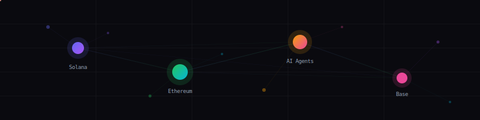

<p align="center">
  
</p>

<p align="center">
  
</p>

<p align="center">
  <a href="https://www.npmjs.com/package/@web3viz/core"></a>
  <a href="https://bundlephobia.com/package/@web3viz/react-graph"></a>
  <a href="LICENSE"></a>
  <a href="https://github.com/nirholas/visualize-web3-realtime/stargazers"></a>
</p>

<p align="center">
  <strong>GPU-accelerated real-time 3D network visualization for Web3 and AI agents.<br/>Built with Next.js 14, React Three Fiber, and D3-force. 5,000+ nodes at 60fps.</strong>
</p>

<p align="center">
  <a href="https://swarming.dev/world"><strong>Live Demo</strong></a> · <a href="docs/"><strong>Documentation</strong></a> · <a href="https://swarming.dev/demos"><strong>Demos</strong></a> · <a href="https://swarming.dev/benchmarks"><strong>Benchmarks</strong></a>
</p>


## Get Started in 30 Seconds

```bash
git clone https://github.com/nirholas/visualize-web3-realtime.git
cd visualize-web3-realtime
npm install && npm run dev
```

Open **http://localhost:3100** — live visualization starts immediately. No API keys needed for the default providers.

Or use the packages directly:

```bash
npm install @web3viz/core @web3viz/react-graph
```

```tsx
import { ForceGraph } from '@web3viz/react-graph'

function App() {
  return <ForceGraph topTokens={hubs} traderEdges={edges} background="#0a0a0f" showLabels />
}
```

<br/>

## Features

<p align="center">
  
</p>

<table>
<tr>
<td width="33%" align="center">
<br />
<strong>60fps @ 5,000 nodes</strong><br />
<sub>InstancedMesh rendering with spatial hashing for O(1) lookups</sub>
</td>
<td width="33%" align="center">
<br />
<strong>Real-time Data Providers</strong><br />
<sub>Built-in provider system for WebSockets, REST, or any custom data stream</sub>
</td>
<td width="33%" align="center">
<br />
<strong>Force-directed 3D physics</strong><br />
<sub>d3-force-3d with framerate-independent damping and configurable springs</sub>
</td>
</tr>
<tr>
<td width="33%" align="center">
<br />
<strong>Rich interaction</strong><br />
<sub>Hover, click, drag, orbit, zoom. Mouse-repulsion physics. Camera fly-to.</sub>
</td>
<td width="33%" align="center">
<br />
<strong>Theming & Design System</strong><br />
<sub>Full component library with dark/light presets and CSS custom properties</sub>
</td>
<td width="33%" align="center">
<br />
<strong>Export & share</strong><br />
<sub>Screenshot with metadata overlay, share URLs, and embeddable widget</sub>
</td>
</tr>
<tr>
<td width="33%" align="center">
<br />
<strong>AI chat assistant</strong><br />
<sub>Natural language graph control via Claude Sonnet with tool-use integration</sub>
</td>
<td width="33%" align="center">
<br />
<strong>Agent monitoring</strong><br />
<sub>3D visualization of AI agent orchestration, tasks, tool calls, and reasoning</sub>
</td>
<td width="33%" align="center">
<br />
<strong>WASM physics engine</strong><br />
<sub>Rust Barnes-Hut simulation compiled to WebAssembly — 3-5x faster than JS</sub>
</td>
</tr>
<tr>
<td width="33%" align="center">
<br />
<strong>Desktop shell UI</strong><br />
<sub>Windows 95-style interface — draggable windows, taskbar, start menu, keyboard shortcuts</sub>
</td>
<td width="33%" align="center">
<br />
<strong>Scrollytelling & landing</strong><br />
<sub>Scroll-driven animations, editorial engine, 3D shader scenes, floating particles</sub>
</td>
<td width="33%" align="center">
<br />
<strong>Multi-framework</strong><br />
<sub>React, Vue, Svelte, React Native, vanilla JS, and CDN embed</sub>
</td>
</tr>
</table>


<br/>

## Supported Chains & Data Sources

| Provider | Chain / Source | Data | Authentication |
|---|---|---|---|
| **PumpFun** | Solana | Token launches, trades, bonding curves, whale detection, sniper detection, fee claims | None required |
| **Ethereum** | Ethereum | Uniswap V2/V3 swaps, ERC-20 transfers, token mints | RPC WebSocket (Alchemy, Infura, or public) |
| **Base** | Base (L2) | DEX swaps, transfers, mints | RPC WebSocket |
| **CEX Volume** | Binance | Spot trades (10 pairs, >$50K filter), futures liquidations | None required |
| **Agent** | Multi-chain | AI agent detection across all providers + cookie.fun rankings | None required |
| **ERC-8004** | Multi-chain | ERC-8004 token events | RPC WebSocket |
| **Mock** | Synthetic | Random events for development and testing | None required |
| **Custom** | Any | User-defined WebSocket, REST, SSE, or callback streams | User-provided |

### AI Agent Detection

The Agent provider detects activity from 15+ AI agent frameworks including Virtuals, ELIZA, AI16Z, DegeneAI, Olas, Fetch.ai, Singularity, and Ocean Protocol via keyword matching and cookie.fun API polling.

### DeFi Protocol Tracking (via MCP)

TVL and metrics for Aave, Uniswap, Compound, MakerDAO, and Lido via DeFi Llama public API.


<br/>

## Pages & Routes

### Core Application

| Route | Description |
|---|---|
| `/` | Scrollytelling home page with scroll-driven animations and dashboard mockups |
| `/world` | **Main 3D visualization** — force graph, desktop shell, AI chat, timeline, provider management, onboarding |
| `/agents` | **AI agent dashboard** — agent/task/tool graph, sidebar, live feed, task inspector, executor connection |
| `/embed` | Embeddable widget with URL param customization (`?theme=`, `?bg=`, `?maxNodes=`, `?labels=`) |
| `/landing` | Alternative marketing page with editorial engine and 3D Giza shader scene |

### Content & Community

| Route | Description |
|---|---|
| `/blog` | 5 technical blog posts (viz engine, websocket-to-3d, comparisons, zero-dom, particles) |
| `/docs/*` | Full documentation hub — Getting Started (3), Guide (17), API Reference (5), Examples (2), Community (4) |
| `/playground` | Interactive code editor + live preview with 5 presets and URL-based sharing |
| `/showcase` | Community gallery with category filtering, sorting, and search |
| `/plugins` | Plugin directory — 6 built-in + 10 community plugins (sources, themes, renderers) |
| `/benchmarks` | Performance comparison charts against 8 graph libraries |

### Demo Scenarios (6)

| Route | Domain | Description |
|---|---|---|
| `/demos/github` | Developer Tools | Repository activity — pushes, PRs, issues, stars, forks |
| `/demos/kubernetes` | Infrastructure | Pod lifecycle — running, pending, error, terminated |
| `/demos/api-traffic` | Infrastructure | HTTP request flow to endpoints, color-coded by status |
| `/demos/ai-agents` | AI & ML | Multi-agent task orchestration (research, code, review, plan) |
| `/demos/social` | Social & Media | Interaction graph — likes, reposts, follows, replies |
| `/demos/iot` | Hardware & IoT | Sensor network — temperature, humidity, motion, pressure, light |

### Tool Showcases (7)

| Route | Description |
|---|---|
| `/tools/ai-office` | Procedural 3D autonomous AI agents — pure math, no imported assets |
| `/tools/blockchain-viz` | Blockchain P2P network simulation with data packets |
| `/tools/cosmograph` | GPU-accelerated WebGL graph via Apache Arrow & DuckDB |
| `/tools/creative-coding` | WebGL shader playground inspired by Cables.gl and Nodes.io |
| `/tools/graphistry` | GPU-powered visual graph intelligence platform |
| `/tools/nveil` | Volumetric 3D data rendering and spatial dashboard |
| `/tools/reagraph` | React-native WebGL network graph using Three.js + D3 |

### API Endpoints (4)

| Endpoint | Method | Description |
|---|---|---|
| `/api/world-chat` | POST | Claude Sonnet chat with 5 scene-manipulation tools. Rate-limited: 20 req/60s per IP |
| `/api/executor` | GET/POST | Proxy to executor backend. Whitelisted paths: /api/status, /api/tasks, /api/agents. Rate-limited: 30 req/60s per IP |
| `/api/agents/cookie` | GET | Proxy to cookie.fun agent rankings API. Cached: 60s ISR + stale-while-revalidate |
| `/api/thumbnail` | GET | Edge-runtime OG image generation per demo category |


<br/>

## Architecture

```
┌────────────────────────────────────────────────────────────────────┐
│                        Browser / Client                            │
│                                                                    │
│  Data Sources (WebSocket/REST)                                     │
│  ├── PumpFun (Solana)    ├── Ethereum (RPC)   ├── Binance (CEX)   │
│  ├── Base (RPC)          ├── cookie.fun (REST) ├── Custom streams  │
│  └── Agent (meta)        └── Mock (synthetic)                      │
│         │                                                          │
│         ▼                                                          │
│  ┌──────────────────────────────────────────────────────┐          │
│  │  useProviders() — buffers, merges, filters events    │          │
│  └──────────────┬───────────────────────────────────────┘          │
│                 │                                                   │
│    ┌────────────┼────────────┬──────────────┐                      │
│    ▼            ▼            ▼              ▼                      │
│  ForceGraph  StatsBar    LiveFeed     DesktopShell                 │
│  (3D R3F)    (metrics)   (events)    (windows UI)                  │
│                                                                    │
│  ┌─────────────────────────────────────────────┐                   │
│  │  Desktop Shell: Taskbar, Start Menu, 8 apps │                   │
│  │  AI Chat, Share, Embed, Filters, Sources... │                   │
│  └─────────────────────────────────────────────┘                   │
└────────────────────────────────────────────────────────────────────┘
```

### Layer Breakdown

| Layer | Package | Responsibility |
|---|---|---|
| **Core** | `@web3viz/core` | Types, ForceGraphSimulation engine, SpatialHash, 34 event categories, plugin system, theme system. Zero React deps. |
| **Providers** | `@web3viz/providers` | Data provider implementations, WebSocketManager (exponential backoff + heartbeat), BoundedMap/BoundedSet, validation |
| **Rendering** | `@web3viz/react-graph` | ForceGraph React Three Fiber component, PostProcessing (bloom/DOF), SwarmingProvider context, WebGPU support |
| **UI** | `@web3viz/ui` | Design system — tokens, ThemeProvider, primitives, composed components |
| **Utilities** | `@web3viz/utils` | WebGL snapshot capture, social sharing (X, LinkedIn), number formatting, share URLs |
| **MCP** | `@web3viz/mcp` | MCP server — 4 AI-readable resources (protocol_stats, recent_trades, agent_activity, proof_status) |
| **Application** | `app/` + `features/` | Next.js 14 pages, API routes, World visualization, Agents dashboard, Scrollytelling, Demos, Tools, Landing |

### Event Categories (34 total)

| Source | Categories |
|---|---|
| **PumpFun** (Solana) | launches, agentLaunches, trades, bondingCurve, whales, snipers, claimsWallet, claimsGithub, claimsFirst |
| **Ethereum** | ethSwaps, ethTransfers, ethMints |
| **Base** | baseSwaps, baseTransfers, baseMints |
| **Agents** | agentDeploys, agentInteractions, agentSpawn, agentTask, toolCall, subagentSpawn, reasoning, taskComplete, taskFailed |
| **ERC-8004** | erc8004Mints, erc8004Transfers, erc8004Updates |
| **CEX** | cexSpotTrades, cexLiquidations |


<br/>

## Desktop Shell UI

The `/world` page features a Windows 95-style desktop interface:

- **8 window apps** — Filters, Live Feed, Stats, AI Chat, Share, Embed, Data Sources, Timeline
- **Draggable/resizable windows** with title bar controls (minimize, maximize, close)
- **Taskbar** with app icons, connection indicators, and system clock
- **Start Menu** launcher with app grid
- **Window state persistence** via localStorage (position, size, z-order)
- **Glassmorphism design** with frosted glass effects
- **Keyboard shortcuts** and connection status toasts
- **7-step onboarding** walkthrough for first-time users


<br/>

## AI Integration

### World Chat

AI assistant embedded in the visualization powered by Claude Sonnet with tool-use. 5 available tools:

| Tool | Description |
|---|---|
| `sceneColorUpdate` | Change scene element colors (RGB/hex) |
| `cameraFocus` | Focus camera on a hub or position |
| `dataFilter` | Filter by protocols, volume, or time range |
| `agentSummary` | Display agent metrics card |
| `tradeVisualization` | Highlight specific trades |

### MCP Server

Model Context Protocol server (`@web3viz/mcp`) exposes live data to AI agents:

| Resource | Source | Description |
|---|---|---|
| `protocol_stats` | DeFi Llama | TVL and metadata for Aave, Uniswap, Compound, MakerDAO, Lido |
| `recent_trades` | Active providers | Real-time trade feed with chain/category filtering |
| `agent_activity` | cookie.fun | Top AI agent rankings (7-day interval) |
| `proof_status` | Local registry | LuminAIR STARK proof verification results (max 500 entries) |

### Agent Monitoring Dashboard

Full agent orchestration visualization at `/agents`:

- **3D force graph** of agents, tasks, and tool nodes with particle trails
- **6 tool categories**: filesystem, search, terminal, network, code, reasoning
- **Agent sidebar** with status indicators (active/idle/error) and tool toggles
- **Task inspector** with tool call output, sub-agent tracking, reasoning text
- **Executor banner** with health monitoring (healthy/degraded/offline/reconnecting)
- **Stats bar**: active agents, task counts, tool calls/min
- **Timeline scrubber** with 1x/2x/4x playback speed
- **Spawn effects**, completion celebrations, reasoning halos, error shake animations


<br/>

## ZK Proof Verification

Built-in Giza LuminAIR integration for STARK proof verification. The `VerifyBadge` and `VerificationModal` components provide step-by-step verification directly in the UI. Gracefully degrades to demo mode if `@gizatech/luminair-web` is not installed.


<br/>

## Multi-Framework Support

swarming runs everywhere:

**React**
```tsx
import { ForceGraph } from '@swarming/react'
<ForceGraph nodes={hubs} edges={connections} />
```

**Vue 3**
```vue
<script setup>
import { SwarmingGraph } from '@swarming/vue'
</script>
<template>
  <SwarmingGraph :nodes="hubs" :edges="connections" />
</template>
```

**Svelte**
```svelte
<script>
import { SwarmingGraph } from '@swarming/svelte'
</script>
<SwarmingGraph {nodes} {edges} />
```

**Vanilla JS / CDN**
```html
<script src="https://unpkg.com/swarming"></script>
<div id="viz"></div>
<script>
  Swarming.create('#viz', { source: 'wss://your-stream.com' })
</script>
```

**React Native (Expo)**
```tsx
import { SwarmingView } from '@swarming/react-native'
<SwarmingView nodes={hubs} edges={connections} />
```


<br/>

## Packages

### Core

| Package | Description |
|---|---|
| [`@web3viz/core`](packages/core/) | Types, ForceGraphSimulation engine, SpatialHash, 34 categories, plugin system, theme system. Zero React deps. |
| [`@web3viz/providers`](packages/providers/) | Data providers: PumpFun, Ethereum, Base, CEX Volume, Agent, Mock, Custom. WebSocketManager, BoundedMap/BoundedSet, validation. |
| [`@web3viz/react-graph`](packages/react-graph/) | `<ForceGraph>` 3D component (React Three Fiber). PostProcessing, SwarmingProvider, WebGPU support. |
| [`@web3viz/ui`](packages/ui/) | Design system — tokens, ThemeProvider, primitives, composed components. Dark/light themes. |
| [`@web3viz/utils`](packages/utils/) | WebGL snapshots, share URLs, social sharing (X, LinkedIn), formatting helpers. |
| [`@web3viz/mcp`](packages/mcp/) | MCP server — DeFi Llama, cookie.fun, proof registry, recent trades. 4 AI-readable resources. |

### Framework Wrappers

| Package | Description |
|---|---|
| [`@swarming/engine`](packages/engine/) | Framework-agnostic force simulation engine. Vanilla JS API. |
| [`@swarming/react`](packages/react/) | React wrapper for the swarming engine. |
| [`@swarming/vue`](packages/vue/) | Vue 3 wrapper. |
| [`@swarming/svelte`](packages/svelte/) | Svelte wrapper. |
| [`@swarming/react-native`](packages/react-native/) | React Native + Expo with GL renderer. |
| [`swarming`](packages/swarming/) | CDN/UMD bundle — zero-build embed via `<script>` tag. |

### Tooling & Infrastructure

| Package | Description |
|---|---|
| [`swarming-physics`](packages/swarming-physics/) | Rust/WASM Barnes-Hut force simulation (3-5x faster than JS d3-force). |
| [`swarming-collab-server`](packages/swarming-collab-server/) | WebSocket relay for multiplayer collaboration (room-based broadcast). |
| [`agent-bridge`](packages/agent-bridge/) | CLI to connect external AI agents (Claude Code, OpenClaw, Hermes) to visualization. |
| [`@web3viz/executor`](packages/executor/) | Agent execution server — WebSocket + REST, Claude SDK, task queue, SQLite state. |
| [`create-swarming-app`](packages/create-swarming-app/) | CLI scaffolder — `npx create-swarming-app`. |
| [`create-swarming-plugin`](packages/create-swarming-plugin/) | Plugin project scaffolder. |


<br/>

## Performance

<p align="center">
  
</p>

InstancedMesh (single draw call per node type), SpatialHash grids, and framerate-independent physics.

| | swarming | d3-force (SVG) | sigma.js | cytoscape |
|---|---|---|---|---|
| **1,000 nodes** | 60 fps | 45 fps | 55 fps | 40 fps |
| **5,000 nodes** | 60 fps | 12 fps | 30 fps | 8 fps |
| **10,000 nodes** | 45 fps | 3 fps | 15 fps | crash |
| **Rendering** | WebGL 3D | SVG / Canvas | WebGL 2D | Canvas 2D |
| **Streaming data** | Built-in | DIY | DIY | DIY |
| **React native** | Yes (R3F) | Wrapper | Wrapper | Wrapper |

### Rendering Budget (per frame at 60fps)

| Operation | Budget | Technique |
|---|---|---|
| Node rendering | ~2ms | InstancedMesh (1 draw call for 5000 nodes) |
| Proximity lines | ~1ms | SpatialHash grid queries + BufferGeometry |
| Physics update | ~1ms | d3-force tick + damping |
| Post-processing | ~3ms | SMAA + N8AO + Bloom (configurable) |
| React overhead | ~1ms | Minimal — graph updates bypass React state |


<br/>

## API Overview

### `<ForceGraph>` Props

| Prop | Type | Description |
|---|---|---|
| `topTokens` | `TopToken[]` | Hub nodes (top entities by volume) |
| `traderEdges` | `TraderEdge[]` | Connections between traders and hubs |
| `height` | `number` | Canvas height |
| `background` | `string` | Scene background color |
| `groundColor` | `string` | Ground plane color |
| `simulationConfig` | `ForceGraphConfig` | Physics parameters (charge, damping, springs) |
| `showLabels` | `boolean` | Toggle hub labels |
| `showGround` | `boolean` | Toggle ground plane |
| `fov` | `number` | Camera field of view |
| `cameraPosition` | `[x, y, z]` | Initial camera position |
| `postProcessing` | `PostProcessingProps` | Bloom, DOF settings |
| `renderer` | `'auto' \| 'webgpu' \| 'webgl'` | Renderer selection |

### Imperative Handle

```tsx
const ref = useRef<GraphHandle>(null)

ref.current.focusHub(0)                            // Fly to hub
ref.current.animateCameraTo([10, 20, 30], origin)  // Custom fly-to
ref.current.setOrbitEnabled(true)                   // Auto-rotate
ref.current.takeSnapshot()                         // Capture WebGL canvas
ref.current.getCanvasElement()                     // Access canvas DOM element
```

Full API reference: [docs/COMPONENTS.md](docs/COMPONENTS.md)


<br/>

## Build Your Own Provider

```typescript
import type { DataProvider } from '@web3viz/core'

class MyProvider implements DataProvider {
  readonly id = 'my-source'
  readonly name = 'My Data Source'
  readonly sourceConfig = { id: 'custom', label: 'Custom', color: '#6366f1', icon: '◉' }
  readonly categories = [
    { id: 'events', label: 'Events', icon: '⚡', color: '#6366f1', source: 'custom' },
  ]

  connect() {
    const ws = new WebSocket('wss://your-stream.com')
    ws.onmessage = (msg) => {
      const data = JSON.parse(msg.data)
      this.emit({
        id: data.id,
        providerId: this.id,
        category: 'events',
        timestamp: Date.now(),
        label: data.name,
        amount: data.value,
      })
    }
  }
}
```

Guide: [docs/PROVIDERS.md](docs/PROVIDERS.md)


<br/>

## Environment Variables

Copy `.env.example` to `.env.local`. The app works without any env vars — PumpFun data streams need no authentication.

| Variable | Required | Default | Description |
|---|---|---|---|
| `ANTHROPIC_API_KEY` | No | — | Claude API key for `/world` AI chat |
| `API_SECRET` | No | — | API key for protected routes (/api/executor, /api/world-chat) |
| `NEXT_PUBLIC_SOLANA_WS_URL` | No | — | Solana RPC WebSocket |
| `NEXT_PUBLIC_ETH_WS_URL` | No | `wss://ethereum-rpc.publicnode.com` | Ethereum RPC WebSocket |
| `NEXT_PUBLIC_BASE_WS_URL` | No | `wss://base-rpc.publicnode.com` | Base chain RPC WebSocket |
| `NEXT_PUBLIC_SPERAXOS_WS_URL` | No | `wss://api.speraxos.io/agents/v1/stream` | Agent event WebSocket |
| `NEXT_PUBLIC_SPERAXOS_API_KEY` | No | — | SperaxOS API key (mock mode if empty) |
| `NEXT_PUBLIC_AGENT_MOCK` | No | `true` | Use mock agent data |
| `EXECUTOR_URL` | No | `http://localhost:8765` | Executor backend URL |
| `EXECUTOR_PORT` | No | `8765` | Executor WebSocket server port |
| `EXECUTOR_MAX_AGENTS` | No | `5` | Max concurrent agents |
| `STATE_PATH` | No | `./data/executor.db` | Executor SQLite database path |


<br/>

## Tech Stack

<p align="center">
  
</p>

| Layer | Technology |
|---|---|
| Framework | Next.js 14 (App Router), React 18 |
| Language | TypeScript (strict mode) |
| 3D Engine | Three.js + React Three Fiber + @react-three/drei |
| Physics | d3-force-3d (CPU) + WASM Barnes-Hut (GPU, Rust) |
| Post-processing | SMAA, N8AO ambient occlusion, selective bloom |
| Animation | Framer Motion |
| Styling | Tailwind CSS + CSS custom properties |
| Typography | IBM Plex Mono (monospace) |
| AI | Claude Sonnet (@anthropic-ai/sdk) with tool-use |
| MCP | Model Context Protocol server (DeFi Llama, cookie.fun, proofs) |
| ZK Proofs | Giza LuminAIR (STARK verification) |
| Code Editor | CodeMirror 6 (playground) |
| Testing | Vitest + jsdom + React Testing Library |
| Monorepo | npm workspaces + Turborepo |
| CI/CD | GitHub Actions (lint, typecheck, build, test, coverage, bundle size) |
| PWA | Web app manifest, app icons (192/512px) |
| SEO | Sitemap (48+ routes), robots.txt, dynamic OG images, JSON-LD |

<p align="center">
  
</p>


<br/>

## Security

- **CSP headers** on all routes (script-src, connect-src, worker-src, frame-ancestors)
- **HSTS** with includeSubDomains
- **Rate limiting** on all API routes (per-IP, memory-bounded)
- **API key authentication** for protected routes via `x-api-key` header
- **Path validation** on executor proxy (no traversal, no protocol schemes)
- **Input sanitization** on chat messages (max 50 messages, 4000 chars each)
- **X-Frame-Options** DENY on all routes except `/embed`
- **Permissions-Policy** blocks camera, microphone, geolocation


<br/>

## Project Structure

```
app/                          # Next.js App Router
  api/                        # API routes (world-chat, executor, agents/cookie, thumbnail)
  world/                      # Main 3D visualization page
  agents/                     # AI agent dashboard
  demos/                      # 6 demo scenarios (github, k8s, api, agents, social, iot)
  tools/                      # 7 tool showcases (ai-office, blockchain-viz, cosmograph...)
  blog/                       # 5 blog posts
  docs/                       # Documentation hub (catch-all route)
  playground/                 # Code editor + live preview
  showcase/                   # Community gallery
  plugins/                    # Plugin directory
  benchmarks/                 # Performance comparisons
  embed/                      # Embeddable widget
  landing/                    # Alternative landing page
features/
  World/                      # 3D blockchain visualization
    desktop/                  # Desktop shell (taskbar, windows, start menu)
    ai/                       # WorldChat + component registry
    verification/             # Giza LuminAIR ZK proof UI
    onboarding/               # 7-step walkthrough
    utils/                    # Formatting, accessibility, screenshots
  Agents/                     # Agent visualization (force graph, sidebar, inspector)
  Scrollytelling/             # Scroll-driven home page animations
  Landing/                    # Editorial engine, 3D Giza scene, GLSL shaders
  Demos/                      # Demo datasets and simulation hook
  Tools/                      # Tool demo components (7 visualizations)
packages/
  core/                       # Types, engine, categories, plugins, themes
  providers/                  # Data providers, WebSocketManager, BoundedMap
  react-graph/                # ForceGraph R3F component, PostProcessing
  ui/                         # Design system, tokens, components
  utils/                      # Snapshots, sharing, formatting
  mcp/                        # MCP server (DeFi Llama, cookie.fun, proofs)
  executor/                   # Agent execution server (broken: missing ws dep)
  engine/                     # Framework-agnostic simulation
  react/                      # React wrapper
  vue/                        # Vue 3 wrapper
  svelte/                     # Svelte wrapper
  react-native/               # React Native + Expo
  swarming/                   # CDN/UMD bundle
  swarming-physics/           # Rust/WASM Barnes-Hut
  swarming-collab-server/     # Multiplayer WebSocket relay
  agent-bridge/               # External agent CLI connector
  create-swarming-app/        # Project scaffolder
  create-swarming-plugin/     # Plugin scaffolder
apps/
  playground/                 # Standalone demo app (broken: broken import)
  mobile-demo/                # Expo React Native demo
hooks/                        # useAgentEvents, useAgentProvider, useAgentKeyboardShortcuts
public/
  .well-known/                # Web3 metadata (x402, nostr, DID, wallets, security.txt)
  diagrams/                   # 18 SVG architecture diagrams
scripts/                      # capture-assets.ts, record-demo.sh, pre-commit hook
benchmarks/                   # Performance benchmarking suite (Playwright + Chrome)
docs/                         # Markdown documentation
prompts/                      # 19 AI development prompts
tasks/                        # 41 project task files
```


<br/>

## Documentation

| Document | Description |
|---|---|
| [Architecture](docs/ARCHITECTURE.md) | System design, data flow, event lifecycle, performance internals |
| [Providers](docs/PROVIDERS.md) | Built-in providers, custom provider guide, key types, tips |
| [Components](docs/COMPONENTS.md) | ForceGraph props, GraphHandle API, UI primitives, design tokens |
| [Deployment](docs/DEPLOYMENT.md) | Vercel, Docker, Netlify, PM2, systemd, env vars |
| [Pages & Routes](docs/PAGES.md) | All 27 pages, 4 API routes, layouts, error boundaries, special files |
| [SDK](SDK.md) | Package descriptions, quick start, template usage guide |
| [Contributing](CONTRIBUTING.md) | Dev setup, code style, PR guidelines, branch naming |
| [Changelog](CHANGELOG.md) | Notable changes grouped by theme |


<br/>

## Use Cases

| | Application | Description |
|---|---|---|
| **Web3** | DeFi, NFTs, DAOs | Real-time visualization of on-chain activity, tokenomics, and governance |
| **AI Agents** | Orchestration graphs | Multi-agent task execution, tool calls, reasoning traces, swarm coordination |
| **Infrastructure** | Service meshes | Kubernetes pods, API traffic, CI/CD pipelines, log clustering |
| **Social** | Interaction networks | Chat flows, follow graphs, content virality cascades |
| **Finance** | Trading activity | Order flow, liquidity movements, whale detection, market microstructure |
| **Blockchain** | Transaction flows | DEX swaps on Ethereum/Base/Solana, token launches, bridge messages |
| **ZK Proofs** | Verification | STARK proof verification with Giza LuminAIR integration |
| **IoT** | Sensor networks | Device telemetry, fleet tracking, energy grid flows |


<br/>

## Community

swarming is open to contributions.

**High-impact areas:**
- New data providers (Arbitrum, Polygon, Bitcoin Ordinals, non-blockchain sources)
- Performance (WebGPU compute shaders, Web Worker offloading)
- Framework wrappers (Vue, Svelte, React Native improvements)
- Mobile/touch interaction and responsive layouts
- Accessibility (keyboard navigation, screen reader, high contrast)
- Documentation and examples
- Tests for core utilities and providers

<a href="CONTRIBUTING.md">Contributing Guide</a> · <a href="https://swarming.dev/showcase">Showcase Gallery</a>


<p align="center">
  MIT License · Built by <a href="https://github.com/nirholas">@nirholas</a>
</p>
