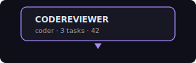

# Task 14: Agent Force Graph Renderer

## Context
After Tasks 12-13, we have agent event types and a data provider that converts SperaxOS events into `TopToken[]` + `TraderEdge[]`. Now we build the dedicated agent visualization — a force-directed 3D graph where:

- **Agent hubs** are large glowing spheres (each active agent)
- **Task nodes** orbit their agent hub (active tasks pulse, completed tasks fade)
- **Tool call particles** are small dots that fly from the agent hub outward when a tool is called
- **Sub-agent edges** connect parent agents to child agents
- **Reasoning halos** show a soft ring around agent hubs during thinking phases

This component is analogous to the existing `features/World/ForceGraph.tsx` but designed specifically for agent activity visualization. It reuses `ForceGraphSimulation` from `@web3viz/core`.

## Reference Visual Style

Think of it like watching a developer's brain work in real-time:
- Each agent is a neuron (large sphere) with synapses (edges) to tools and tasks
- When an agent starts thinking: a soft expanding halo appears
- When a tool is called: a particle shoots from the agent to a tool cluster node
- When a task completes: a green pulse ring expands outward from the agent
- When a task fails: a red flash
- Sub-agents appear as smaller hub spheres connected by a bright edge to the parent
- Idle agents slowly breathe (subtle scale oscillation)

## What to Build

### 1. Agent Force Graph Component (`features/Agents/AgentForceGraph.tsx` — NEW)

The main visualization component. Structure similar to `features/World/ForceGraph.tsx`:

```typescript
interface AgentForceGraphProps {
  /** Agent TopTokens (each agent = a hub) */
  agents: TopToken[];
  /** Tool call edges (tool calls = trader edges) */
  toolEdges: TraderEdge[];
  /** Active flow traces for visual state */
  flows: Map<string, AgentFlowTrace>;
  /** Executor state for heartbeat display */
  executorState: ExecutorState | null;
  /** Recent agent events for live animations */
  recentEvents: AgentEvent[];
  /** Currently selected agent ID */
  activeAgentId: string | null;
  /** Callback when an agent hub is clicked */
  onAgentSelect: (agentId: string | null) => void;
  /** Background color */
  backgroundColor?: string;
  /** Share colors override */
  shareColors?: ShareColors;
}
```

Inner components (all inside the R3F Canvas):

#### `AgentHubNode` — Individual Agent Spheres
- Large sphere per agent (radius scaled by total activity: tasks completed + tool calls)
- Default color: dark (#1a1a2e), selected: agent brand color from palette
- **Breathing animation**: subtle scale oscillation (sin wave, period 3s) when idle
- **Thinking halo**: when `reasoning:start` event is active, show a semi-transparent expanding ring (drei `<Ring>` with animated scale)
- **Completion pulse**: on `task:completed`, emit an expanding ring that fades out (green)
- **Error flash**: on `task:failed`, brief red flash on the sphere
- Hover: show `<Html>` label pill with agent name + role (same style as `ProtocolLabel.tsx`)
- Click: select this agent (zoom camera to it, filter sidebar to its tasks)

#### `TaskNodes` — InstancedMesh of Active Tasks  
- Small spheres orbiting their parent agent hub
- Color varies by status:
  - `planning`: amber/yellow, slow pulse
  - `in-progress`: blue, steady glow  
  - `waiting`: gray, dim
  - `completed`: green, then fade out over 2s
  - `failed`: red, then fade out over 2s
- Position: arranged in a ring around the agent hub (angle = taskIndex / totalTasks * 2π)
- Each task node slowly orbits (rotates around hub over ~20s)
- Max ~50 visible task nodes per agent (older completed tasks are removed)

#### `ToolCallParticles` — Animated Tool Invocations
- When a `tool:started` event arrives, spawn a particle that flies from the agent hub toward a "tool cluster" node
- Tool cluster nodes are smaller fixed hubs positioned around the outside of the graph:
  - `filesystem` (📁), `search` (🔍), `terminal` (>_), `network` (🌐), `code` (⟨/⟩), `reasoning` (◎)
- Particle travels along a curved path (bezier), takes ~1s
- On `tool:completed`, the particle returns from the tool cluster to the agent (reverse path)
- Use `InstancedMesh` for particles (pool of ~200, recycled)
- Trail effect: each particle leaves a faded trail (3-4 ghost positions behind it)

#### `SubAgentEdges` — Parent-to-Child Agent Connections
- Dashed or dotted line between parent agent hub and sub-agent hub
- Line pulses with activity (opacity oscillates)
- Color: same as parent agent's brand color but at 50% opacity

#### `AgentEdges` — Background Structure Lines
- Thin gray lines between all agent hubs (like world view's hub-to-hub lines)
- Tool cluster nodes connected to their most active agent hub

#### `ExecutorHeartbeat` — Global Pulse
- A very subtle, slow pulse that expands from the center of the graph
- Synced to executor heartbeat events (every 30s)
- Green when healthy, yellow when slow, red when no heartbeat for 60s
- Shows uptime counter as a small label at the bottom center

#### `CameraSetup` — Same Pattern as World View
- Top-down-ish perspective with MapControls (pan/zoom, no rotation)
- Animated camera transitions when selecting agents
- Auto-fit: camera should initially frame all agent hubs

### 2. Agent Color Constants (`features/Agents/constants.ts` — NEW)

```typescript
export const AGENT_COLOR_PALETTE = [
  '#c084fc',  // Purple (primary agent color)
  '#60a5fa',  // Blue
  '#f472b6',  // Pink
  '#34d399',  // Green
  '#fbbf24',  // Amber
  '#fb923c',  // Orange
  '#a78bfa',  // Violet
  '#22d3ee',  // Cyan
];

export const AGENT_COLORS = {
  default: '#1a1a2e',
  highlight: '#c084fc',
  agentDefault: '#2a2d3e',
  taskActive: '#60a5fa',
  taskComplete: '#34d399',
  taskFailed: '#f87171',
  taskPlanning: '#fbbf24',
  toolParticle: '#818cf8',
  reasoning: '#c084fc40',  // Semi-transparent purple for halo
  heartbeatHealthy: '#34d399',
  heartbeatWarning: '#fbbf24',
  heartbeatDead: '#f87171',
};

export const TOOL_CLUSTER_POSITIONS: Record<string, [number, number]> = {
  filesystem: [-20, 15],
  search: [20, 15],
  terminal: [-20, -15],
  network: [20, -15],
  code: [0, 20],
  reasoning: [0, -20],
};

export const TOOL_CLUSTER_ICONS: Record<string, string> = {
  filesystem: '📁',
  search: '🔍',
  terminal: '>_',
  network: '🌐',
  code: '⟨/⟩',
  reasoning: '◎',
};

export const AGENT_GRAPH_CONFIG = {
  maxTaskNodes: 200,
  maxToolParticles: 200,
  toolParticleSpeed: 0.02,   // units per frame
  toolParticleLifespan: 120, // frames
  taskOrbitRadius: 4,
  taskOrbitSpeed: 0.001,     // radians per frame
  breathingAmplitude: 0.05,  // scale units
  breathingPeriod: 3000,     // ms
  pulseExpandScale: 3,       // how much the pulse ring expands
  pulseDuration: 1000,       // ms
};
```

### 3. Agent Hover Label (`features/Agents/AgentLabel.tsx` — NEW)

Reuse the same visual style as `features/World/ProtocolLabel.tsx`:
- Dark pill with white text
- Show agent name (bold) + role (lighter)
- Below: active task count, tool calls count
- Small downward caret



### 4. Task Inspector Tooltip (`features/Agents/TaskInspector.tsx` — NEW)

When hovering over a task node, show a richer tooltip:
- Task description
- Status with color indicator
- Duration (if started)
- Tool calls made
- Sub-agents spawned

Uses `<Html>` from drei, positioned at the task node.

## Files to Create
- `features/Agents/AgentForceGraph.tsx` — **NEW** Main agent visualization
- `features/Agents/AgentLabel.tsx` — **NEW** Agent hover label
- `features/Agents/TaskInspector.tsx` — **NEW** Task hover tooltip
- `features/Agents/constants.ts` — **NEW** Agent colors, positions, config

## Files to Reference (do not modify in this task)
- `features/World/ForceGraph.tsx` — Follow same patterns for R3F + d3-force integration
- `features/World/ProtocolLabel.tsx` — Follow same label style
- `features/World/constants.ts` — Follow same constant organization
- `packages/core/src/engine/ForceGraphSimulation.ts` — Reuse for layout

## Performance Requirements
- 60fps with 10 agent hubs + 200 task nodes + 200 tool particles
- InstancedMesh for task nodes and tool particles
- Frustum culling on all meshes
- Particle pool (don't allocate/deallocate — recycle from a fixed pool)

## Acceptance Criteria
- [ ] Agent hubs render as 3D spheres with correct sizing
- [ ] Task nodes orbit their parent agent hub
- [ ] Tool call particles animate from agent to tool cluster and back
- [ ] Breathing animation on idle agents
- [ ] Thinking halo appears during reasoning events
- [ ] Completion pulse ring on task complete
- [ ] Error flash on task failure
- [ ] Hover labels show agent name + stats
- [ ] Camera pans to selected agent on click
- [ ] Sub-agent edges render as dashed lines
- [ ] Executor heartbeat pulse is visible
- [ ] Performance stays at 60fps with full mock data
- [ ] `npx next build` passes
