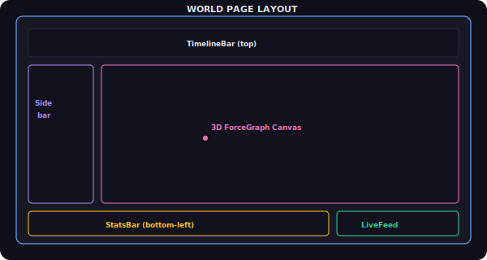
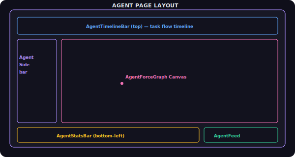
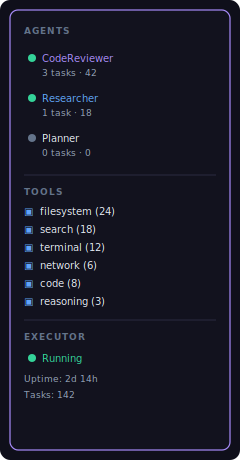
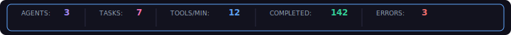

# Task 15: Agent Page Assembly (`/agents`)

## Context
After Task 14, we have `AgentForceGraph` — the 3D visualization of agent activity. Now we need to assemble the full `/agents` page with all surrounding UI chrome: sidebar filters, stats bar, live feed, and the 3D graph.

This page is the agent equivalent of `app/world/page.tsx`. It follows the same layout pattern but with agent-specific data and controls.

## Reference: World Page Layout

The existing `/world` page layout (for reference):



The `/agents` page should follow the same pattern but with agent-specific components.

## What to Build

### 1. Agent Page Route (`app/agents/page.tsx` — NEW)



The page should:
- Use `useAgentProvider({ mock: true })` to get agent data (mock for now)
- Pass agent `TopToken[]` and `TraderEdge[]` to `AgentForceGraph`
- Manage state: `activeAgentId`, `activeToolCategory`, timeline position
- Lazy-load `AgentForceGraph` with `next/dynamic` (no SSR)
- Set dark background (#0a0a0f) for the immersive agent view

### 2. Agent Sidebar (`features/Agents/AgentSidebar.tsx` — NEW)

Left sidebar showing active agents and their status. Similar to `features/World/ProtocolFilterSidebar.tsx` but for agents:



Features:
- Click an agent → sets `activeAgentId`, zooms camera to that agent hub
- Click again → deselects (shows all)
- Tool categories are toggleable filters (show/hide tool call particles by category)
- Executor status section at bottom with health indicator
- Agent list auto-updates as agents spawn/shutdown
- Status dot colors: green=active task, blue=idle, gray=shutdown, red=error

### 3. Agent Stats Bar (`features/Agents/AgentStatsBar.tsx` — NEW)

Bottom stats bar showing real-time agent metrics. Similar to `features/World/StatsBar.tsx`:



Stats to show:
- Active agents count
- Active tasks count  
- Tool calls per minute (rolling 60s window)
- Total tasks completed
- Total errors
- Uptime

Each stat should have a label + value with the category color. Values update in real-time with a subtle number animation (lerp to new value).

### 4. Agent Live Feed (`features/Agents/AgentLiveFeed.tsx` — NEW)

Right-side scrolling feed of agent events, similar to `features/World/LiveFeed.tsx`:



Features:
- Auto-scrolls to newest events
- Pauses auto-scroll when user scrolls up manually
- Each event shows: icon (by type), agent name, event type, description, relative timestamp
- Click an event → selects the corresponding agent in the graph
- Events color-coded by type (tool=blue, task=purple, complete=green, error=red)
- Max ~50 visible events in the feed (older ones scroll out)

### 5. Agent Page Layout (`app/agents/layout.tsx` — NEW)

Minimal layout wrapper (same pattern as `app/world/` — but no special layout needed if the main layout suffices). Include appropriate metadata:

```typescript
export const metadata = {
  title: 'Agent World — Visualize AI Agents in Real-Time',
  description: 'Watch autonomous AI agents complete tasks, call tools, and coordinate in real-time.',
};
```

### 6. Navigation Link

Add a link to the `/agents` page from the world header or add a toggle/nav element. The simplest approach: add an "Agents" button to the existing header/nav that links to `/agents`.

Check if there's a header in `packages/ui/src/composed/WorldHeader.tsx` or the page layout and add a nav link there.

## Files to Create
- `app/agents/page.tsx` — **NEW** Agent page route
- `app/agents/layout.tsx` — **NEW** Agent page layout
- `features/Agents/AgentSidebar.tsx` — **NEW** Agent/tool filter sidebar
- `features/Agents/AgentStatsBar.tsx` — **NEW** Bottom stats bar
- `features/Agents/AgentLiveFeed.tsx` — **NEW** Live event feed

## Files to Modify
- `packages/ui/src/composed/WorldHeader.tsx` or `app/layout.tsx` — Add nav link to `/agents`

## Files to Reference
- `app/world/page.tsx` — Follow same page assembly pattern
- `features/World/ProtocolFilterSidebar.tsx` — Follow same sidebar pattern
- `features/World/StatsBar.tsx` — Follow same stats bar pattern
- `features/World/LiveFeed.tsx` — Follow same live feed pattern

## Acceptance Criteria
- [ ] `/agents` route renders the full agent visualization page
- [ ] Agent sidebar shows agent list with status indicators
- [ ] Clicking an agent in sidebar selects it in the graph
- [ ] Tool categories are toggleable filters
- [ ] Stats bar shows real-time agent metrics
- [ ] Live feed shows scrolling agent events
- [ ] Feed auto-scrolls but pauses when user scrolls up
- [ ] All components work with mock data
- [ ] Navigation between `/world` and `/agents` works
- [ ] Page is responsive (sidebar collapses on mobile)
- [ ] Dark theme (#0a0a0f background) for immersive feel
- [ ] `npx next build` passes
