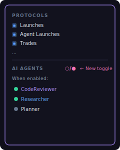

# Task 16: Agent Overlay on World View

## Context
After Tasks 14-15, we have a dedicated `/agents` page. Now we add the ability to toggle agent nodes into the existing `/world` crypto visualization — so users can see agents and crypto activity in the same graph.

The existing `/world` page shows PumpFun tokens as hub nodes and trader wallets as agent nodes. We want to optionally overlay SperaxOS agent hubs into this same graph, so users can see both crypto activity and AI agent activity simultaneously.

## What to Build

### 1. Merged Data Provider Mode

Update `hooks/useDataProvider.ts` to support an `includeAgents` toggle:

```typescript
interface UseDataProviderOptions {
  /** Include agent data alongside crypto data */
  includeAgents?: boolean;
}

function useDataProvider(options?: UseDataProviderOptions): DataProviderReturn {
  const pumpFun = usePumpFun();
  const claims = usePumpFunClaims();
  const agents = useAgentProvider({ 
    mock: process.env.NEXT_PUBLIC_AGENT_MOCK === 'true',
    enabled: options?.includeAgents ?? false,
  });

  // When includeAgents is true, merge:
  // - topTokens: crypto tokens + agent identities (agents as hub nodes)
  // - traderEdges: trade edges + tool call edges
  // - recentEvents: all events merged and sorted by timestamp
  // - counts: merged category counts
}
```

Key considerations:
- Agent hub nodes should be visually distinguishable from crypto hub nodes (different default color, or a subtle badge/ring)
- Agent hub radius should be comparable to crypto hubs (scale by activity, not volume)
- Tool call edges behave just like trader edges in the force simulation
- The force simulation doesn't need changes — it already handles hub + agent node types generically

### 2. Agent Toggle in World Sidebar

Add an "AI Agents" toggle to the existing `ProtocolFilterSidebar`:



When the "AI Agents" toggle is ON:
- Agent hubs appear in the force graph alongside crypto hubs
- Agent tool calls appear as agent nodes (like trader nodes)
- The stats bar includes agent counts
- The live feed includes agent events

When OFF (default):
- Pure crypto visualization (current behavior unchanged)

### 3. Visual Distinction in ForceGraph

In `features/World/ForceGraph.tsx`, agent hub nodes from the provider need visual distinction:

- **Agent hubs** get a subtle outer ring (like a Saturn ring) or a different geometry (icosphere vs smooth sphere) to distinguish from crypto hubs
- Agent hub default color uses the agent palette (#c084fc purple tint) instead of the crypto dark color
- When selected/filtered: agent hubs use their agent brand color
- Agent hover labels show "🤖 AGENT_NAME" prefix to distinguish from token labels

Implementation approach:
- The `TopToken` objects from the agent provider should have a `source: 'agents'` field
- In `HubNodeMesh`, check if `source === 'agents'` and render the ring/different color
- Alternatively, add a small particle ring or glow effect around agent hubs

### 4. Update World Page State

In `app/world/page.tsx`, add:

```typescript
const [showAgents, setShowAgents] = useState(false);

// Pass to useDataProvider
const { stats, ... } = useDataProvider({ includeAgents: showAgents });

// Pass toggle to sidebar
<ProtocolFilterSidebar 
  showAgents={showAgents}
  onToggleAgents={() => setShowAgents(prev => !prev)}
  agentList={agentProvider.agents}  // for the agent list section
/>
```

### 5. URL State Sync

Add `?agents=true` URL parameter support (same pattern as existing `?protocols=` param):

```typescript
// Read from URL
const params = useSearchParams();
const agentsFromUrl = params.get('agents') === 'true';

// Sync to URL on toggle
const updateUrl = (show: boolean) => {
  const newParams = new URLSearchParams(params);
  if (show) newParams.set('agents', 'true');
  else newParams.delete('agents');
  router.replace(`?${newParams.toString()}`);
};
```

## Files to Modify
- `hooks/useDataProvider.ts` — Add `includeAgents` option, merge agent stats
- `features/World/ProtocolFilterSidebar.tsx` — Add "AI Agents" toggle section
- `features/World/ForceGraph.tsx` — Visual distinction for agent hub nodes (ring/color)
- `app/world/page.tsx` — Add `showAgents` state, URL sync, pass to components

## Files to Reference
- `hooks/useAgentProvider.ts` — Agent data source (from Task 13)
- `features/Agents/constants.ts` — Agent color palette (from Task 14)

## Acceptance Criteria
- [ ] "AI Agents" toggle appears in the World sidebar
- [ ] Toggle is OFF by default (pure crypto view)
- [ ] When enabled, agent hubs appear in the force graph
- [ ] Agent hubs are visually distinguishable from crypto hubs (ring/color/icon)
- [ ] Tool call edges render as agent nodes around agent hubs
- [ ] Force simulation handles mixed crypto + agent nodes smoothly
- [ ] Stats bar and live feed include agent data when enabled
- [ ] `?agents=true` URL parameter persists the toggle
- [ ] Toggling agents on/off doesn't reset the crypto graph
- [ ] Performance remains acceptable with agents + crypto combined
- [ ] `npx next build` passes
