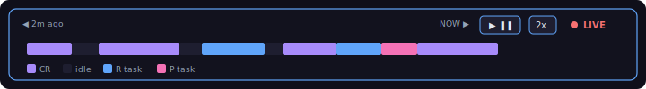
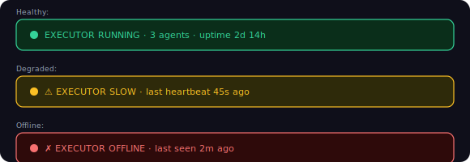

# Task 17: Agent UI Chrome — Timeline, Task Inspector, Status Indicators

## Context
After Tasks 14-16, we have the agent force graph and page. Now we add the rich UI chrome that makes agent activity understandable: a task timeline scrubber, a detailed task inspector panel, and visual status indicators.

## What to Build

### 1. Agent Timeline Bar (`features/Agents/AgentTimeline.tsx` — NEW)

A horizontal timeline at the top of the `/agents` page showing agent task activity over time. Different from the World timeline (which shows dates) — this shows task flows:



Features:
- Horizontal bar showing the last N minutes of agent activity
- Color blocks represent active task periods per agent (stacked or color-coded rows)
- Scrubber handle to drag back in time (replay past events)
- Play/pause button — when paused, new events buffer but don't advance the view
- Speed control: 1x, 2x, 4x for replaying past events
- "LIVE" indicator (red dot + label) when at the current time
- Clicking a block in the timeline selects that agent and scrolls the feed to that time

Implementation:
- Canvas-based rendering for the timeline blocks (better perf than DOM elements)
- Use the `AgentEvent[]` timestamps to build activity blocks
- Integrate with the page's scrub position state

### 2. Task Inspector Panel (`features/Agents/TaskInspector.tsx` — NEW/UPDATE)

A slide-out panel (right side) that shows detailed information about a selected task. Triggered by:
- Clicking a task node in the 3D graph
- Clicking a task in the live feed
- Clicking a task block in the timeline



Features:
- Slide-in from right (300px wide) with backdrop blur
- Shows full task details: agent, status, duration, tool calls, sub-agents, reasoning
- Tool call list shows tool name, input summary, status, duration
- Status icons: ✓ completed (green), ⏳ running (blue), ✗ failed (red)
- Sub-agent section shows child agents spawned for this task
- Reasoning section shows the latest reasoning text (from `reasoning:update` events)
- Close button (✕) or click outside to dismiss
- Auto-updates as new events arrive for this task

### 3. Agent Status Indicators (`features/Agents/AgentStatusIndicator.tsx` — NEW)

Small status indicator components used across the UI:

```typescript
interface AgentStatusIndicatorProps {
  status: 'active' | 'idle' | 'error' | 'shutdown';
  size?: 'sm' | 'md' | 'lg';
  showLabel?: boolean;
  pulse?: boolean;  // animated pulse for active state
}
```

Visual:
- Colored dot (green=active, blue=idle, red=error, gray=shutdown)
- Optional pulse animation on active state
- Used in: sidebar agent list, stats bar, task inspector, live feed

### 4. Executor Status Banner (`features/Agents/ExecutorBanner.tsx` — NEW)

A thin banner at the very top of the `/agents` page showing executor health:



Features:
- Green/yellow/red background based on health
- Shows: status, agent count, uptime
- Collapses to a thin line when healthy (doesn't take much space)
- Expands with warning details when degraded/offline
- Appears above the timeline bar

### 5. Keyboard Shortcuts

Add keyboard shortcuts for the agent page:

| Key | Action |
|---|---|
| `Space` | Play/pause timeline |
| `←` / `→` | Step timeline backward/forward |
| `Escape` | Close task inspector, deselect agent |
| `1`-`9` | Select agent by index |
| `F` | Fit camera to all agents |
| `L` | Toggle live feed visibility |

Register via a `useAgentKeyboardShortcuts` hook.

### 6. Integrate into Agent Page

Update `app/agents/page.tsx` to include all the new UI elements:

```typescript
<div className="relative w-full h-screen bg-[#0a0a0f]">
  <ExecutorBanner executorState={executorState} />
  <AgentTimeline events={recentEvents} agents={agents} ... />
  
  <div className="flex h-full">
    <AgentSidebar ... />
    
    <div className="flex-1 relative">
      <AgentForceGraph ... />
    </div>
    
    <AgentLiveFeed ... />
  </div>
  
  <AgentStatsBar ... />
  
  {selectedTask && (
    <TaskInspector 
      task={selectedTask} 
      toolCalls={toolCallsForTask}
      onClose={() => setSelectedTask(null)}
    />
  )}
</div>
```

## Files to Create
- `features/Agents/AgentTimeline.tsx` — **NEW** Task timeline scrubber
- `features/Agents/AgentStatusIndicator.tsx` — **NEW** Reusable status dot
- `features/Agents/ExecutorBanner.tsx` — **NEW** Executor health banner
- `hooks/useAgentKeyboardShortcuts.ts` — **NEW** Keyboard shortcut handler

## Files to Modify
- `features/Agents/TaskInspector.tsx` — Upgrade from tooltip to full slide-out panel
- `app/agents/page.tsx` — Integrate all UI elements

## Acceptance Criteria
- [ ] Agent timeline bar renders at top of page with task activity blocks
- [ ] Timeline is scrubbable (drag to past)
- [ ] Play/pause controls work
- [ ] Task inspector slide-out shows full task details
- [ ] Tool call list in inspector updates in real-time
- [ ] Reasoning text streams in as events arrive
- [ ] Agent status indicators show correct colors and pulse
- [ ] Executor banner reflects connection health
- [ ] Banner collapses when healthy, expands when degraded
- [ ] Keyboard shortcuts work (Space, arrows, Escape, number keys)
- [ ] All components integrate cleanly into the agents page
- [ ] `npx next build` passes
