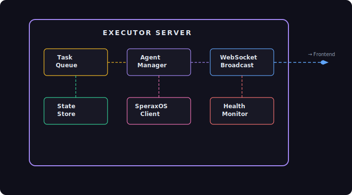

# Task 18: Autonomous Agent Executor

## Context
After Tasks 12-17, we have the full visualization frontend for agent activity. Now we build the backend: a 24/7 autonomous agent executor that runs agents continuously, manages their lifecycle, and broadcasts events via WebSocket for the frontend to consume.

This executor:
- Runs as a standalone Node.js process (can be deployed independently)
- Manages multiple concurrent agents
- Queues and assigns tasks to agents
- Broadcasts all events via WebSocket server
- Persists state for crash recovery
- Integrates with SperaxOS agent API for task execution

## Architecture



## What to Build

### 1. Executor Package (`packages/executor/` — NEW)

Create a new package in the monorepo:

```
packages/executor/
├── package.json
├── tsconfig.json
├── src/
│   ├── index.ts              # Entry point — starts the executor
│   ├── ExecutorServer.ts     # Main executor orchestrator
│   ├── AgentManager.ts       # Manages agent lifecycles
│   ├── TaskQueue.ts          # Priority task queue
│   ├── EventBroadcaster.ts   # WebSocket server for event broadcasting
│   ├── StateStore.ts         # Persistent state (SQLite or JSON file)
│   ├── HealthMonitor.ts      # Heartbeat, health checks, alerting
│   ├── SperaxOSClient.ts     # SperaxOS API client
│   └── types.ts              # Executor-specific types (re-exports from core)
```

#### `package.json`
```json
{
  "name": "@web3viz/executor",
  "version": "0.1.0",
  "private": true,
  "type": "module",
  "scripts": {
    "start": "tsx src/index.ts",
    "dev": "tsx watch src/index.ts",
    "build": "tsc"
  },
  "dependencies": {
    "@web3viz/core": "workspace:*",
    "ws": "^8.16.0",
    "better-sqlite3": "^11.0.0"
  },
  "devDependencies": {
    "@types/ws": "^8.5.10",
    "@types/better-sqlite3": "^7.6.8",
    "tsx": "^4.7.0",
    "typescript": "^5.3.0"
  }
}
```

### 2. Executor Server (`src/ExecutorServer.ts`)

The main orchestrator:

```typescript
interface ExecutorConfig {
  /** Port for the WebSocket server */
  port: number;
  /** SperaxOS API endpoint */
  speraxosUrl: string;
  /** SperaxOS API key */
  speraxosApiKey: string;
  /** Maximum concurrent agents */
  maxAgents: number;
  /** Task polling interval (ms) */
  taskPollInterval: number;
  /** Heartbeat interval (ms) */
  heartbeatInterval: number;
  /** State persistence path */
  statePath: string;
}

class ExecutorServer {
  constructor(config: ExecutorConfig);
  
  /** Start the executor (connect to SperaxOS, start WS server, begin task processing) */
  start(): Promise<void>;
  
  /** Graceful shutdown */
  stop(): Promise<void>;
  
  /** Add a task to the queue */
  enqueueTask(task: TaskDefinition): string;
  
  /** Get executor status */
  getStatus(): ExecutorState;
}
```

Lifecycle:
1. **Start**: Initialize state store → Connect to SperaxOS → Start WebSocket server → Begin task loop
2. **Task Loop**: Poll queue → Assign to available agent → Monitor execution → Handle result
3. **Heartbeat**: Every 30s, broadcast status to all WebSocket clients
4. **Shutdown**: Drain queue → Wait for active tasks → Save state → Close connections

### 3. Agent Manager (`src/AgentManager.ts`)

Manages the pool of active agents:

```typescript
class AgentManager {
  /** Spawn a new agent (sends request to SperaxOS) */
  spawnAgent(config: AgentSpawnConfig): Promise<AgentIdentity>;
  
  /** Assign a task to an available agent */
  assignTask(task: AgentTask): Promise<void>;
  
  /** Get an available (idle) agent, or null */
  getAvailableAgent(): AgentIdentity | null;
  
  /** Handle an event from an agent */
  handleEvent(event: AgentEvent): void;
  
  /** Shutdown a specific agent */
  shutdownAgent(agentId: string): Promise<void>;
  
  /** Get all active agents */
  getActiveAgents(): AgentIdentity[];
}
```

Agent spawning strategy:
- Start with a configurable number of agents (default: 3)
- Auto-scale: if all agents are busy and queue has items, spawn more (up to `maxAgents`)
- Auto-retire: if an agent is idle for 5 minutes and there are excess agents, shut it down
- Agent roles: configurable default roles (e.g., 2 coders + 1 researcher)

### 4. Task Queue (`src/TaskQueue.ts`)

Priority-based task queue with persistence:

```typescript
interface TaskDefinition {
  description: string;
  priority?: number;          // 0 = highest (default: 5)
  requiredRole?: string;      // e.g., 'coder', 'researcher'
  timeout?: number;           // ms before task is considered stalled
  retryCount?: number;        // max retries on failure (default: 1)
  metadata?: Record<string, unknown>;
}

class TaskQueue {
  /** Add a task to the queue */
  enqueue(task: TaskDefinition): string;  // returns taskId
  
  /** Get the next task for a specific role (or any) */
  dequeue(role?: string): AgentTask | null;
  
  /** Mark a task as completed/failed */
  complete(taskId: string, result: string): void;
  fail(taskId: string, error: string): void;
  
  /** Get queue stats */
  getStats(): { queued: number; inProgress: number; completed: number; failed: number };
  
  /** Get all tasks (for state inspection) */
  getAll(): AgentTask[];
}
```

Features:
- Priority ordering (lower number = higher priority)
- Role-based filtering (tasks can require a specific agent role)
- Timeout detection (stalled tasks are re-queued after timeout)
- Retry logic (failed tasks retry up to `retryCount` times)
- Persistent (survives process restart via StateStore)

### 5. Event Broadcaster (`src/EventBroadcaster.ts`)

WebSocket server that streams events to visualization clients:

```typescript
class EventBroadcaster {
  constructor(port: number);
  
  /** Start the WebSocket server */
  start(): void;
  
  /** Broadcast an event to all connected clients */
  broadcast(event: AgentEvent): void;
  
  /** Broadcast executor state (heartbeat) */
  broadcastState(state: ExecutorState): void;
  
  /** Get number of connected clients */
  getClientCount(): number;
  
  /** Stop the server */
  stop(): void;
}
```

Protocol:
- Clients connect to `ws://localhost:{port}`
- On connect: server sends a `snapshot` message with current state (all active agents, tasks, recent events)
- Ongoing: server sends individual `AgentEvent` JSON messages
- Every 30s: server sends a `heartbeat` message with `ExecutorState`
- Client can send `subscribe` message to filter events (e.g., only certain agents)

Message format:
```json
{
  "type": "event",
  "data": { /* AgentEvent */ }
}

{
  "type": "snapshot",
  "data": {
    "agents": [ /* AgentIdentity[] */ ],
    "tasks": [ /* AgentTask[] */ ],
    "recentEvents": [ /* AgentEvent[] */ ]
  }
}

{
  "type": "heartbeat",
  "data": { /* ExecutorState */ }
}
```

### 6. State Store (`src/StateStore.ts`)

Persistent state using SQLite (via `better-sqlite3`):

```typescript
class StateStore {
  constructor(dbPath: string);
  
  /** Save/update an agent */
  saveAgent(agent: AgentIdentity): void;
  
  /** Save/update a task */
  saveTask(task: AgentTask): void;
  
  /** Save an event (for replay) */
  saveEvent(event: AgentEvent): void;
  
  /** Load all active agents */
  loadActiveAgents(): AgentIdentity[];
  
  /** Load all pending/in-progress tasks */
  loadActiveTasks(): AgentTask[];
  
  /** Load recent events (for snapshot) */
  loadRecentEvents(limit: number): AgentEvent[];
  
  /** Get aggregate stats */
  getStats(): { totalTasks: number; totalEvents: number; uptime: number };
}
```

Tables:
- `agents` — id, name, role, status, created_at, updated_at
- `tasks` — id, agent_id, description, status, priority, created_at, started_at, ended_at, result, error
- `events` — id, type, agent_id, task_id, timestamp, payload (JSON)
- `executor_state` — key-value store for uptime, start_time, etc.

### 7. Health Monitor (`src/HealthMonitor.ts`)

Monitors executor health and alerts on issues:

```typescript
class HealthMonitor {
  /** Start monitoring */
  start(): void;
  
  /** Report current health */
  getHealth(): {
    status: 'healthy' | 'degraded' | 'critical';
    checks: HealthCheck[];
  };
  
  /** Register a health check */
  addCheck(name: string, check: () => HealthCheck): void;
}

interface HealthCheck {
  name: string;
  status: 'pass' | 'warn' | 'fail';
  message: string;
  timestamp: number;
}
```

Built-in checks:
- **SperaxOS connection**: API reachable and authenticated
- **Agent responsiveness**: All agents responded within timeout
- **Task queue depth**: Queue not growing unboundedly
- **Memory usage**: Process memory under threshold
- **Event rate**: Events flowing (not stuck)

### 8. SperaxOS Client (`src/SperaxOSClient.ts`)

HTTP/WebSocket client for the SperaxOS agent API:

```typescript
class SperaxOSClient {
  constructor(baseUrl: string, apiKey: string);
  
  /** Spawn a new agent on SperaxOS */
  spawnAgent(config: AgentSpawnConfig): Promise<AgentIdentity>;
  
  /** Send a task to an agent */
  executeTask(agentId: string, task: AgentTask): Promise<void>;
  
  /** Get agent status */
  getAgentStatus(agentId: string): Promise<AgentIdentity>;
  
  /** Subscribe to agent events (WebSocket) */
  subscribeEvents(agentId: string, callback: (event: AgentEvent) => void): () => void;
  
  /** Check API health */
  healthCheck(): Promise<boolean>;
}
```

Note: This is the client for the actual SperaxOS API. If the API spec isn't finalized, implement a basic version that can be updated later. The mock mode (from Task 13's `useAgentEventsMock`) can substitute for development.

### 9. Entry Point (`src/index.ts`)

```typescript
import { ExecutorServer } from './ExecutorServer';

const config = {
  port: parseInt(process.env.EXECUTOR_PORT || '8765'),
  speraxosUrl: process.env.SPERAXOS_URL || 'https://api.speraxos.io',
  speraxosApiKey: process.env.SPERAXOS_API_KEY || '',
  maxAgents: parseInt(process.env.MAX_AGENTS || '5'),
  taskPollInterval: 1000,
  heartbeatInterval: 30000,
  statePath: process.env.STATE_PATH || './data/executor.db',
};

const executor = new ExecutorServer(config);

// Graceful shutdown
process.on('SIGINT', async () => {
  console.log('Shutting down executor...');
  await executor.stop();
  process.exit(0);
});

process.on('SIGTERM', async () => {
  await executor.stop();
  process.exit(0);
});

executor.start().then(() => {
  console.log(`Executor running on ws://localhost:${config.port}`);
});
```

### 10. REST API (Optional but recommended)

Add a simple HTTP API alongside the WebSocket server for task management:

```
POST   /api/tasks          — Enqueue a new task
GET    /api/tasks           — List all tasks
GET    /api/tasks/:id       — Get task details
DELETE /api/tasks/:id       — Cancel a task
GET    /api/agents          — List active agents
GET    /api/status          — Executor status + health
POST   /api/agents/spawn    — Manually spawn an agent
POST   /api/agents/:id/stop — Stop an agent
```

This allows external systems to submit tasks to the executor and check status.

## Files to Create
- `packages/executor/package.json` — **NEW** Package definition
- `packages/executor/tsconfig.json` — **NEW** TypeScript config
- `packages/executor/src/index.ts` — **NEW** Entry point
- `packages/executor/src/ExecutorServer.ts` — **NEW** Main orchestrator
- `packages/executor/src/AgentManager.ts` — **NEW** Agent lifecycle manager
- `packages/executor/src/TaskQueue.ts` — **NEW** Priority task queue
- `packages/executor/src/EventBroadcaster.ts` — **NEW** WebSocket broadcast server
- `packages/executor/src/StateStore.ts` — **NEW** SQLite persistence
- `packages/executor/src/HealthMonitor.ts` — **NEW** Health monitoring
- `packages/executor/src/SperaxOSClient.ts` — **NEW** SperaxOS API client
- `packages/executor/src/types.ts` — **NEW** Re-exports + executor-specific types

## Files to Modify
- `package.json` (root) — Add executor to workspaces
- `turbo.json` — Add executor build/dev tasks
- `.env.example` — Add executor environment variables

## Acceptance Criteria
- [ ] `packages/executor` compiles with `tsc`
- [ ] `npm run dev` in executor starts the WebSocket server
- [ ] WebSocket clients can connect and receive events
- [ ] Snapshot message sent on client connect (current state)
- [ ] Heartbeat messages broadcast every 30s
- [ ] Task queue persists across restarts (SQLite)
- [ ] Agent manager auto-scales agents based on queue depth
- [ ] Stalled task detection and re-queue works
- [ ] Health monitor reports correct status
- [ ] Graceful shutdown saves state and closes connections
- [ ] REST API endpoints respond correctly
- [ ] Frontend `useAgentEvents` hook can connect to the executor WebSocket
- [ ] Works with mock mode (no SperaxOS API key needed for local dev)
