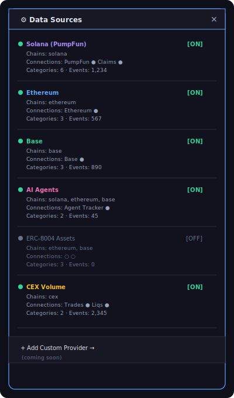

# Task 30: Provider Management Panel

## Goal
Add a UI panel that lets users see, enable/disable, and configure data providers at runtime. This is the "pluggability" surface — users should be able to see what's connected, toggle providers on/off, and understand what each provider does.

## Prerequisites
- Tasks 21-29 must be complete

## Design

### Panel Location
Add a gear/settings icon button to the **bottom-left** of the screen (near the existing sidebar controls). Clicking it opens a slide-out panel from the left side, similar to how SharePanel slides from the right.

### Panel Layout



### Functionality

**Per-provider controls:**
1. **Toggle switch**: Enable/disable a provider. When disabled:
   - `provider.disconnect()` is called
   - Its events are hidden from the feed
   - Its categories are removed from the sidebar
   - Its hub nodes are removed from the graph
2. **Connection status dots**: Green = connected, red = disconnected, gray = disabled
3. **Event count**: Total events received from this provider
4. **Chain badges**: Small colored pills showing which chains the provider covers

**Global controls:**
1. **"Add Custom Provider"** button (future feature — show as disabled/coming soon for now)
2. Total events/second counter

### State Management

The `useDataProvider` hook needs a new capability: disabling providers.

Add to the hook:
```typescript
const [disabledProviders, setDisabledProviders] = useState<Set<string>>(new Set());

const toggleProvider = useCallback((providerId: string) => {
  setDisabledProviders(prev => {
    const next = new Set(prev);
    if (next.has(providerId)) {
      next.delete(providerId);
      // Reconnect
      const provider = getProvider(providerId);
      provider?.connect();
    } else {
      next.add(providerId);
      // Disconnect
      const provider = getProvider(providerId);
      provider?.disconnect();
    }
    return next;
  });
}, []);
```

The `mergeStats` function should skip disabled providers.
The `allCategories` should exclude categories from disabled providers.
The `connections` should include disabled providers (shown as gray).

## Files to Create

### 1. `features/World/ProviderPanel.tsx`

```typescript
'use client';

import { memo, useMemo } from 'react';
import type { DataProvider, CategoryConfig } from '@web3viz/core';

interface ProviderPanelProps {
  open: boolean;
  onClose: () => void;
  providers: DataProvider[];
  disabledProviders: Set<string>;
  onToggleProvider: (id: string) => void;
  connections: Record<string, boolean>;
  stats: { counts: Record<string, number> };
}

const ProviderPanel = memo<ProviderPanelProps>(({ 
  open, onClose, providers, disabledProviders, 
  onToggleProvider, connections, stats 
}) => {
  // ... render panel
  // Style: same visual language as SharePanel (dark bg, monospace, slide from left)
  // Each provider card shows:
  // - Name + toggle switch
  // - Chain badges (colored pills)
  // - Connection indicators (green/red/gray dots)
  // - Category count
  // - Event count (sum of stats.counts for this provider's categories)
});
```

Key visual elements per provider card:
- **Toggle switch**: Minimal CSS toggle (no external lib). When off, card is dimmed.
- **Chain badges**: Small colored pills using `CHAIN_COLORS` from constants
- **Connection dots**: Iterate provider's categories to infer connections, or use the `connections` map
- **Event counter**: Sum all `stats.counts[cat.id]` for this provider's categories

### 2. Update `app/world/page.tsx`

Add state for the provider panel:
```typescript
const [providerPanelOpen, setProviderPanelOpen] = useState(false);
```

Add a settings button near the existing sidebar controls:
```tsx
<button
  onClick={() => setProviderPanelOpen(true)}
  title="Data Sources"
  style={{
    // Same style as embed/share/pause buttons
    position: 'absolute',
    left: 16,
    bottom: 16,
    // ... gear icon styling
  }}
>
  ⚙
</button>

<ProviderPanel
  open={providerPanelOpen}
  onClose={() => setProviderPanelOpen(false)}
  providers={providers}
  disabledProviders={disabledProviders}
  onToggleProvider={toggleProvider}
  connections={connections}
  stats={stats}
/>
```

### 3. Update `hooks/useDataProvider.ts`

Add `disabledProviders`, `toggleProvider` to the hook's return value.

Update `mergeStats` to skip disabled providers:
```typescript
const activeProviders = providers.filter(p => !disabledProviders.has(p.id));
const mergedStats = mergeStats(activeProviders);
```

Return the new values:
```typescript
return {
  stats,
  filteredEvents,
  enabledCategories,
  toggleCategory,
  connections,
  allCategories,
  categoryConfigMap,
  providers,
  disabledProviders,     // new
  toggleProvider,         // new
};
```

## Styling

Match the existing app aesthetic:
- **Background**: `rgba(255, 255, 255, 0.95)` with backdrop blur
- **Font**: IBM Plex Mono
- **Toggle switches**: Simple pill shape, green when on, gray when off
- **Animations**: Slide in from left with Framer Motion (`animate={{ x: 0 }}` from `x: -320`)
- **Width**: 320px
- **Z-index**: Same as SharePanel (above graph, below modals)

**Provider card:**
```css
{
  background: '#f8f8f8',
  borderRadius: 8,
  padding: '12px 16px',
  display: 'flex',
  flexDirection: 'column',
  gap: 6,
  opacity: isDisabled ? 0.5 : 1,
  transition: 'opacity 200ms',
}
```

**Chain badge:**
```css
{
  fontSize: 9,
  padding: '2px 6px',
  borderRadius: 10,
  background: chainColor,
  color: '#fff',
  fontWeight: 600,
}
```

**Toggle switch:**
```css
{
  width: 36,
  height: 20,
  borderRadius: 10,
  background: isEnabled ? '#34d399' : '#d1d5db',
  position: 'relative',
  cursor: 'pointer',
  transition: 'background 200ms',
}
/* Knob */
{
  width: 16,
  height: 16,
  borderRadius: '50%',
  background: '#fff',
  position: 'absolute',
  top: 2,
  left: isEnabled ? 18 : 2,
  transition: 'left 200ms',
  boxShadow: '0 1px 3px rgba(0,0,0,0.2)',
}
```

## Verification

1. Gear icon visible at bottom-left
2. Clicking opens the provider panel
3. All registered providers listed with correct names and chains
4. Connection dots are green/red based on actual WebSocket state
5. Toggle switch disables a provider:
   - Its WebSocket disconnects
   - Its events disappear from live feed
   - Its categories disappear from sidebar
   - Its hub nodes disappear from graph
6. Re-enabling reconnects and events resume
7. Panel slides smoothly with animation
8. Panel closes on ✕ click and Escape key

## Important Notes
- The provider panel is informational + control. It does NOT let users edit provider configs (URLs, API keys) — that's done via `.env.local`.
- The "Add Custom Provider" button is a placeholder for future functionality where users could paste a WebSocket URL and define a custom provider through the UI.
- Keep the panel lightweight — it should not re-render on every event. Use refs or debouncing for event counters.
- The panel must work with 0 providers (show empty state) and with many providers (scrollable).
